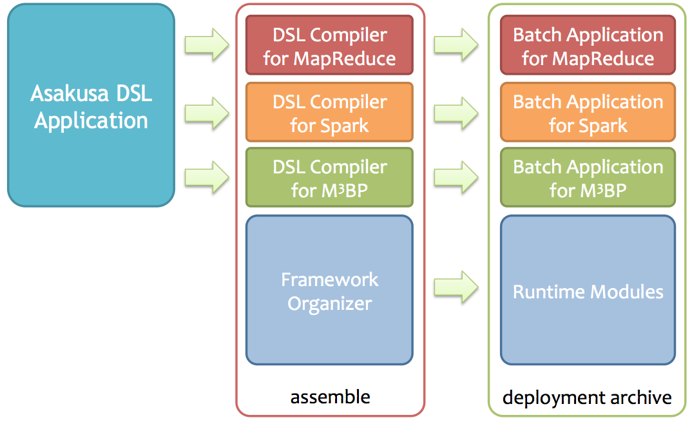
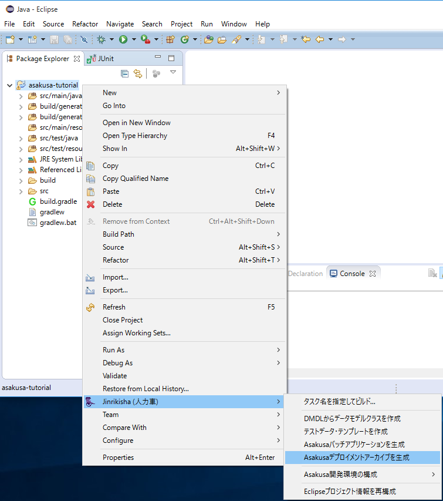

==========================
デプロイ用パッケージの作成
==========================

このチュートリアルでは、Asakusa Frameworkの実行モジュール一式をパッケージした **デプロイメントアーカイブ** を生成する方法を説明していきます。

デプロイメントアーカイブ
========================

Asakusa Frameworkで開発したバッチアプリケーションは、HadoopやSparkのクラスター環境、もしくはM\ :sup:`3`\ BPを利用する高性能マシンなどに配置して実行します。
ここではこれらの環境をまとめて **運用環境** と呼びます。

Asakusa Frameworkを運用環境で利用するには、バッチアプリケーションの他にも以下のようなAsakusa Frameworkの実行モジュール一式を配置する必要があります。

* Asakusa Frameworkで生成したバッチアプリケーション
* Asakusa Framework本体の実行ライブラリ
* Asakusa Frameworkのバッチ実行ツール
* Asakusa Frameworkの外部システム連携モジュール
* 各種設定ファイル

Asakusa Frameworkでは、プロジェクトのビルド設定に従ってこれらの実行モジュール一式を **デプロイメントアーカイブ** と呼ばれる単一のファイルにパッケージングすることができます。

デプロイメントアーカイブを生成する
==================================

それではまず、プロジェクトのデフォルト設定でデプロイメントアーカイブを生成してみましょう。

Eclipse上でデプロイメントアーカイブを生成
-----------------------------------------

Shafuを導入したEclipse環境では、デプロイメントアーカイブの生成をコンテキストメニューから実行することができます。

1. プロジェクトを選択してコンテキストメニュー(右クリックなどで表示されるメニュー)を表示します。
2. コンテキストメニューの :guilabel:`Jinrikisha (人力車)` を選択し、サブメニューとして表示される :guilabel:`Asakusaデプロイメントアーカイブを生成` を選択します。

コマンドライン上でデプロイメントアーカイブを生成
------------------------------------------------

コマンドライン上からデプロイメントアーカイブを生成する場合は、Gradleの :program:`assemble` タスクを実行します。

..  code-block:: sh

    ./gradlew assemble

アーカイブファイルを確認する
----------------------------

アプリケーションプロジェクトの標準設定でデプロイメントアーカイブを生成すると、
プロジェクトの ``build`` フォルダ配下にデプロイメントアーカイブが ``asakusafw-${project.name}.tar.gz`` というファイル名で生成されます。

デプロイメント構成のカスタマイズ
================================

デプロイメントアーカイブが持つデプロイメント構成は、実行環境に応じて構成を変更したり、拡張モジュールを追加したりと、様々な利用状況に応じてカスタマイズすることができるようになっています。

デプロイメント構成の変更を行うには、プロジェクトフォルダの直下にあるGradleのビルドスクリプト ``build.gradle`` を編集します。
このチュートリアルの手順で構築したプロジェクトに含まれる ``build.gradle`` は以下のようになっています。

..  literalinclude:: config-attachment/default-build.gradle
    :language: groovy
    :linenos:
    :caption: build.gradle
    :name: build.gradle.default

以降では、デプロイメント構成に対して簡単なカスタマイズを行っていきます。

プロファイルの構成
------------------

デプロイメント構成の定義は、 ``build.gradle`` 内の ``asakusafwOrganizer`` ブロックに対して行います。

標準の ``build.gradle`` には ``asakusafwOrganizer`` ブロックは存在しないので、まずこのブロックを作成します。
このブロックは ``apply plugin: ...`` と書かれている行より下に作成します。

..  code-block:: groovy
    :caption: build.gradle
    :name: build.gradle-1
    :emphasize-lines: 8-9

    ...
    apply plugin: 'asakusafw-sdk'
    apply plugin: 'asakusafw-organizer'
    apply plugin: 'asakusafw-spark'
    apply plugin: 'eclipse'

    asakusafwOrganizer {
    }

次に、 ``asakusafwOrganizer`` 内に標準プロファイルを表す ``profiles.prod`` ブロックを作成します。

..  code-block:: groovy
    :caption: build.gradle
    :name: build.gradle-2
    :emphasize-lines: 2-3

    asakusafwOrganizer {
        profiles.prod {
        }
    }

**プロファイル** とは、特定の環境向けにデプロイメントアーカイブの構成を設定するための仕組みです。
プロファイルを定義することで、例えばテスト環境と本番環境でそれぞれ異なる構成をもつデプロイメントアーカイブを定義する、といったことが可能になります。

ここでは、標準で定義されているプロファイル ``prod`` に対する定義を変更していきます。

アーカイブファイル名の変更
--------------------------

`デプロイメントアーカイブを生成する`_ の手順で生成されるアーカイブファイル名は任意の名前に変更することができます。

アーカイブファイル名を変更するにはプロファイルのブロック内（ここでは ``profiles.prod`` ブロック）に ``archiveName <アーカイブファイル名>`` を追加します。

..  code-block:: groovy
    :caption: build.gradle
    :name: build.gradle-3
    :emphasize-lines: 4

    asakusafwOrganizer {
        profiles.prod {
            archiveName "${project.name}.tar.gz"
        }
    }

``${project.name}`` は、標準では ``build.gradle`` が含まれるディレクトリ名になります。
このチュートリアルの場合は ``asakusa-tutorial.tar.gz`` というファイルが生成されるようになります。

デプロイメント構成に対するファイルの追加
----------------------------------------

作成するデプロイメントアーカイブに任意のファイルやディレクトリを追加することができます。

ファイルを追加するには、 ``assembly.into(<追加先>) { put <追加元> }`` のように指定します。

..  code-block:: groovy
    :caption: build.gradle
    :name: build.gradle-4
    :emphasize-lines: 4-6

    asakusafwOrganizer {
        profiles.prod {
            archiveName "${project.name}.tar.gz"
            assembly.into('example-dataset') {
                put 'src/test/example-dataset'
            }
        }
    }

ここでは、デプロイメントアーカイブに運用環境で使用する疎通確認用のテストデータを追加します。
上記の例ではプロジェクトのフォルダ ``src/test/example-dataset`` に含まれるテストデータを ``example-dataset`` というディレクトリ名でデプロイメントアーカイブに追加しています。

テストデータの作成
------------------

上記のデプロイメント構成に対応するため、プロジェクト上のソースフォルダ ``src/test/example-dataset`` 配下にテストデータを配置します。

ここではバッチアプリケーションの入力データとなる以下の3ファイルを作成します。

* :download:`master/item_info.csv <config-attachment/example-dataset/master/item_info.csv>` : 商品マスタ
* :download:`master/store_info.csv <config-attachment/example-dataset/master/store_info.csv>` : 店舗マスタ
* :download:`sales/2011-04-01.csv <config-attachment/example-dataset/sales/2011-04-01.csv>` : 売上明細

デプロイメントアーカイブの再作成
--------------------------------

これまでの手順を実施した上で `デプロイメントアーカイブを生成する`_ の手順を再度実行すると、
アーカイブファイルがプロジェクトの ``build`` フォルダ配下にデプロイメントアーカイブが ``asakusa-tutorial.tar.gz`` というファイル名で生成され、
このアーカイブファイルにはテストデータが同梱されています。

このアーカイブファイルは次のチュートリアル :doc:`deploy-on-spark` で使用します。

終わりに
========

このチュートリアル終了時点のGradleのビルドスクリプト :file:`build.gradle` は、次のようになります。

..  literalinclude:: config-attachment/assemble-finished-build.gradle
    :language: groovy
    :linenos:
    :caption: build.gradle
    :name: build.gradle.assemble-finished

関連ドキュメント
================

* :asakusafw:`[Asakusa Framework documentation] - Asakusa Gradle Pluginユーザーガイド <application/gradle-plugin.html>`
* :asakusafw:`[Asakusa Framework documentation] - Asakusa Gradle Plugin リファレンス <application/gradle-plugin-reference.html>`
* :asakusafw:`[Asakusa Framework documentation] - Asakusa Framework デプロイメントガイド <administration/deployment-guide.html>`
