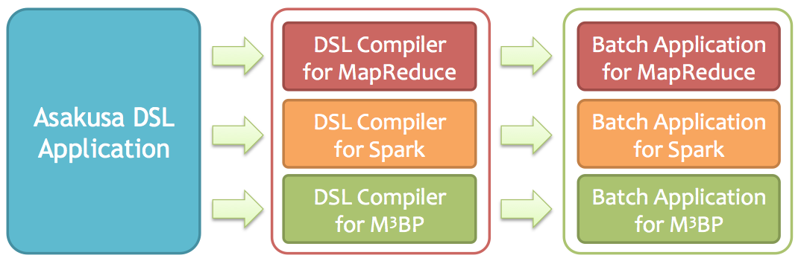
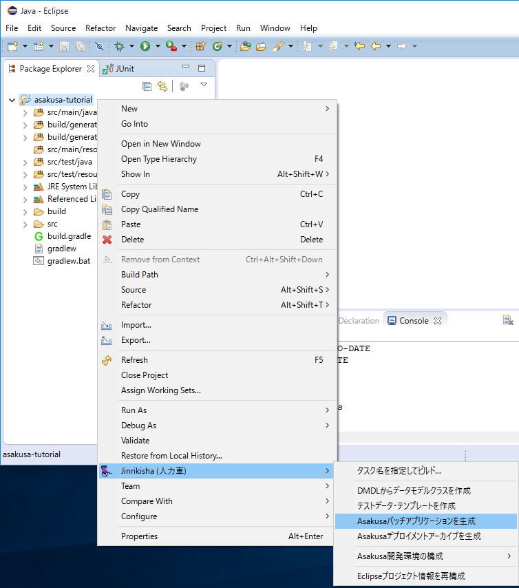

==================
バッチのコンパイル
==================

このチュートリアルでは、Asakusa DSLのソースコードをコンパイルして実行可能なバッチアプリケーションを生成する方法を説明していきます。

Batch DSLコンパイラ
===================

:doc:`dsl-batch` で作成したバッチは **Batch DSLコンパイラ** を使ってコンパイルすることで、
Asakusa Frameworkが対応している各実行プラットフォーム上で実行可能なバッチアプリケーションを生成することができます。

Batch DSLコンパイラは各実行プラットフォーム向けにそれぞれ異なるコンパイラを提供しています。
現時点では以下のBatch DSLコンパイラを利用することができます。

..  list-table:: Batch DSLコンパイラ
    :widths: 3 7
    :header-rows: 1

    * - Batch DSLコンパイラ
      - 説明
    * - MapReduce DSLコンパイラ
      - Hadoop MapReduce上で実行するバッチアプリケーションを生成する
    * - Spark DSLコンパイラ
      - Apache Spark上で実行するバッチアプリケーションを生成する
    * - M\ :sup:`3`\ BP DSLコンパイラ
      - M\ :sup:`3`\ BP上で実行するバッチアプリケーションを生成する

プロジェクトに対してどのBatch DSLコンパイラを利用するかは、プロジェクトのビルド設定で指定します。

このチュートリアルの手順でプロジェクトを作成した状態では **Spark DSLコンパイラ** が利用可能になっています。

バッチアプリケーションをコンパイルする
======================================

それでは、Batch DSLコンパイラを実行して実行可能なバッチアプリケーションを生成してみましょう。

Eclipse上でバッチアプリケーションをコンパイル
---------------------------------------------

Shafuを導入したEclipse環境では、Batch DSLコンパイラをコンテキストメニューから実行することができます。

1. プロジェクトを選択してコンテキストメニュー(右クリックなどで表示されるメニュー)を表示します。
2. コンテキストメニューの :guilabel:`Jinrikisha (人力車)` を選択し、サブメニューとして表示される :guilabel:`Asakusaバッチアプリケーションを生成` を選択します。

コマンドライン上でバッチアプリケーションをコンパイル
----------------------------------------------------

コマンドライン上からBatch DSLコンパイラを実行するは、Gradleの :program:`compileBatchapp` タスクを実行します。

..  code-block:: sh

    ./gradlew compileBatchapp

コンパイルエラーに対応する
--------------------------

コンパイル対象のDSLに問題があるなどの理由でバッチアプリケーションの生成に失敗した場合には、コンソールにエラーメッセージが表示されコンパイルが中断されます。

..  code-block:: none

    ...
    INFO  compiling batch class: com.example.batch.SummarizeBatch
    ERROR output port "out" of "CategorySummaryOperator#summarizeByCategory(@Summarize)" is not connected to the other input port nor jobflow output (com.example.flowpart.CategorySummaryFlowPart)
    ERROR input port "port" of "N/A{name=categorySummary}" is not connected from the other output port nor jobflow input (com.example.flowpart.CategorySummaryFlowPart)
    ...

エラーメッセージにはコンパイルが失敗した原因と、該当のクラスが表示されます。

上記の例は、フロー部品 ``CategorySummaryFlowPart`` において演算子 ``summarizeByCategory`` の出力ポート ``out`` をデータフローの出力 ``categorySummary`` に接続する処理を記述し忘れていた場合のエラーです。

Flow DSLでは、演算子の出力は必ずいずれかの演算子への入力、もしくはジョブフローからの出力と接続されている必要があります。
またデータフローの入力や出力も同様に、他の要素と接続されていなければなりません。
このようにBatch DSLコンパイラはデータフローの接続に対する厳密なチェックを行います。

なおデータフロー内で演算子の出力を意図的に利用せず捨てたい場合は、停止演算子( ``CoreOperatorFactory.stop()`` )を利用してその出力を利用しないことを明示的にコンパイラに指示する必要があります。

コンパイル結果を確認する
------------------------

Batch DSLコンパイラが生成したバッチアプリケーションは、デフォルトではコンパイラの種類ごとに以下のディレクトリに出力されます。
各バッチアプリケーションはバッチクラスごとに、バッチIDに基づくサブディレクトリ配下に生成されます。

..  list-table:: バッチアプリケーションの出力先
    :widths: 3 7
    :header-rows: 1

    * - Asakusa DSLコンパイラ
      - 出力ディレクトリ
    * - Spark DSLコンパイラ
      - :file:`build/spark-batchapps/spark.<batch-id>`
    * - M\ :sup:`3`\ BP DSLコンパイラ
      - :file:`build/m3bp-batchapps/m3bp.<batch-id>`
    * - MapReduce DSLコンパイラ
      - :file:`build/batchc/<batch-id>`

関連ドキュメント
================

* :asakusafw:`[Asakusa Framework documentation] - Asakusa DSLユーザーガイド <dsl/user-guide.html>`
* :asakusafw:`[Asakusa Framework documentation] - Asakusa Gradle Pluginユーザーガイド <application/gradle-plugin.html>`

各コンパイラのリファレンス
--------------------------

Asakusa DSLコンパイラの各リファレンスドキュメントには、コンパイラオプションなどの詳細な情報が記載されています。

* :asakusafw:`[Asakusa Framework documentation] - Asakusa on Spark リファレンス <spark/reference.html>`
* :asakusafw:`[Asakusa Framework documentation] - Asakusa on M3BP リファレンス <m3bp/reference.html>`
* :asakusafw:`[Asakusa Framework documentation] - Asakusa on MapReduce リファレンス <mapreduce/reference.html>`

