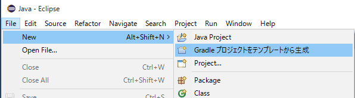
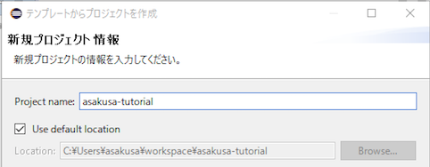
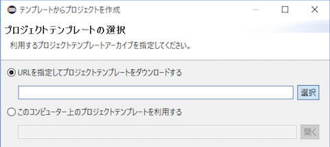
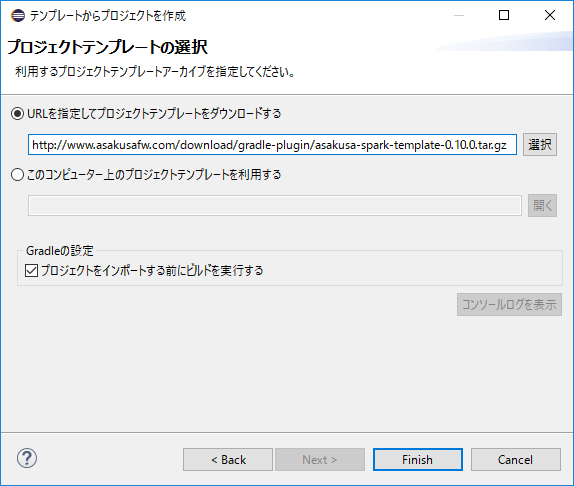
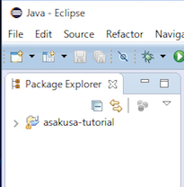

==================
プロジェクトの作成
==================

このチュートリアルでは、Asakusa Frameworkアプリケーション開発用のプロジェクトを作成します。

テンプレートからアプリケーションプロジェクトを作成
==================================================

バッチアプリケーションの開発をはじめるには、まずAsakusa Frameworkアプリケーション開発用のプロジェクトを作成します。

このプロジェクトを作成するには、オンライン上に公開されているAsakusa Framework用のプロジェクトテンプレートを利用すると便利です。

プロジェクトテンプレートにはビルドツール(Gradleラッパー)やその設定ファイル、開発環境で利用するライブラリ向けの設定ファイルなどが含まれていて、
このプロジェクト上ですぐにアプリケーションの開発を始めることができます。

Eclipse上でプロジェクトを作成
-----------------------------

Shafuを導入したEclipse環境では、ウィザードに従ってプロジェクトテンプレートから新規プロジェクトを作成することができます。

1. Javaパースペクティブ上のメニューバーから :menuselection:`File --> New --> Gradleプロジェクトをテンプレートから生成` を選択します。

2. 新規プロジェクト情報 ダイアログで、プロジェクト名などを入力します。ここでは ``asakusa-tutorial`` というプロジェクト名を入力します。

3. テンプレートからプロジェクトの選択 ダイアログで :guilabel:`URLを指定してプロジェクトテンプレートをダウンロードする` が選択状態になっていることを確認して、画面右の :guilabel:`選択` ボタンを押下します。

4. プロジェクトテンプレート ダイアログにオンラインに公開されている、利用可能なプロジェクトテンプレートの一覧が表示されます。
   ここでは、 :guilabel:`Asakusa Project Template <Spark> - 0.10.1` を選択して、 :guilabel:`OK` ボタンを押下します。

..  figure:: images/create-project-select-template.png

..  note::
    上記のバージョン選択画面でバージョン ``0.10.1`` 以降の0.10系リリース版 ( ``0.10.2`` など ) が指定可能になっている場合は、最新のバージョンを選択することを推奨します。

5. テンプレートからプロジェクトの選択 ダイアログに戻ると、 :guilabel:`URLを指定してプロジェクトテンプレートをダウンロードする` に選択したプロジェクトテンプレートのURLが入力されています。
   この状態で :guilabel:`Finish` ボタンを押すと、選択したプロジェクトテンプレートに基づいて新規プロジェクトが作成されます。

..  note::
    開発環境ではじめてこの手順を実施する際には、Asakusa Frameworkのライブラリをリモートリポジトリからダウンロードするため、数分程度の時間がかかることがあります。

6. プロジェクトの作成が成功すると、パッケージエクスプローラーに作成したプロジェクトが表示されます。

その他の方法
------------

Shafuを導入したEclipse以外の環境を利用する場合は、以下のURLに公開されているプロジェクトテンプレートをダウンロードして展開してください。

* `asakusa-spark-template-0.10.1.tar.gz <http://www.asakusafw.com/download/gradle-plugin/asakusa-spark-template-0.10.1.tar.gz>`_

IDEを利用する場合はこのプロジェクトをIDEにインポートしてください。

プロジェクトのディレクトリ構成
==============================

プロジェクトテンプレートから作成したプロジェクトディレクトリには、以下のディレクトリ/ファイルが含まれます。

..  list-table:: プロジェクトのディレクトリ構成
    :widths: 3 7
    :header-rows: 1

    * - ファイル/ディレクトリ
      - 説明
    * - :file:`build.gradle`
      - Gradleビルドスクリプト
    * - :file:`src`
      - プロジェクトのソースディレクトリ
    * - :file:`build`
      - プロジェクトのビルドディレクトリ（ビルド時に生成）
    * - :file:`gradlew`
      - Gradleラッパーコマンド (Unix)
    * - :file:`gradlew.bat`
      - Gradleラッパーコマンド (Windows)
    * - :file:`.buildtools`
      - Gradleラッパーライブラリ

:file:`build.gradle` はプロジェクトのビルドに関する設定ファイルです。
ビルドに関する設定を変更する場合に、このファイルを編集します。

:file:`src` ディレクトリは作成するアプリケーションに関するソースファイルを配置します。
通常、 :file:`src/main` 配下にはアプリケーションの実装に関するファイル、 :file:`src/test` にはアプリケーションのテストに関するファイルを配置します。

:file:`build` ディレクトリはプロジェクトをビルドすることで生成される成果物が配置されます。
このディレクトリ配下のファイルはビルドの度にディレクトリの初期化やファイルの再作成が行われる可能性があるので、直接編集しないようにしてください。

Gradleラッパーに関するファイルやディレクトリはコマンドライン上からGradleを使ったビルドを実行するために使用します。
これらのディレクトリやファイルは直接編集しないようにしてください。

トラブルシューティング
======================

このチュートリアルに関するトラブルシューティングです。

プロジェクト生成メニューが表示されない
--------------------------------------

`Eclipse上でプロジェクトを作成`_ の手順で、Javaパースペクティブ上のメニューバーから :menuselection:`File --> New` を選択しても、
サブメニューに :guilabel:`Gradleプロジェクトをテンプレートから生成` が表示されない。

想定される原因
~~~~~~~~~~~~~~

Shafuのインストール後にJavaパースペクティブが初期化されていない可能性があります。
メニューバーから :menuselection:`Window --> Perspective --> Reset Perspective..` を選択後、再度メニューを表示してください。

それでも表示されない場合は、以下の手順でメニューの設定を行なってください。

#. メニューバーから :menuselection:`Window --> Perspective --> Customize Perspective..` を選択します。
#. Customize Perspectiveダイアログから :guilabel:`Shortcuts` タブを選択します。
#. 画面左上の :guilabel:`Submenus` が :guilabel:`New` になっていることを確認後、 :guilabel:`Shortcut Categories:` のリストから :guilabel:`Jinrikisha (人力車)` を選択します。
#. :guilabel:`OK` ボタンを押下して設定を保存した後、再度メニューを表示してください。

上記の手順でもメニューが表示されない場合は、Shafuが正しくインストールされていない可能性があります。
:doc:`eclipse-shafu` の手順を確認してください。

プロジェクトの作成に失敗する
----------------------------

`Eclipse上でプロジェクトを作成`_ の手順を実行すると、以下のエラーメッセージが表示されプロジェクトの作成に失敗する。

..  code-block:: none

    ...
    :compileJava FAILED

    FAILURE: Build failed with an exception.

    * What went wrong:
    Execution failed for task ':compileJava'.
    > Cannot find System Java Compiler. Ensure that you have installed a JDK (not just a JRE) and configured your JAVA_HOME system variable to point to the according directory.
    ...

想定される原因
~~~~~~~~~~~~~~

Eclipseが利用するJavaにJDKが登録されていない可能性があります。
:doc:`eclipse-shafu` の手順を確認して、JDKが登録されていることを確認してください。

複数のJava環境が登録されている場合、Eclipse設定画面の :menuselection:`Installed JREs --> Execution-Environments` の ``JavaSE-1.8`` の項目にJDKが表示されていること、
およびJDKにチェックがON(デフォルトで利用する)になっていることを確認してください。
