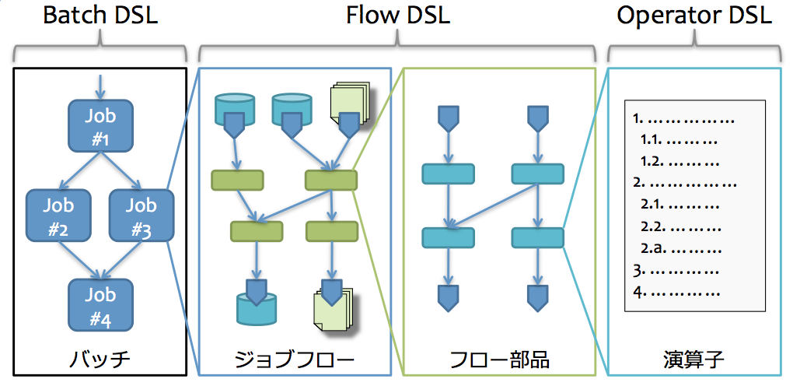

==========================
アプリケーション開発の流れ
==========================

ここでは、Asakusa Frameworkを使ったバッチアプリケーションの開発の流れを説明します。
このチュートリアルは、ここで説明する開発の流れに沿って構成されています。

概要
====

Asakusa Frameworkを使ったアプリケーション開発の流れを、下図に示します。

..  figure:: images/development-process.png

以降では、各開発作業の概要を見ていきます。

アプリケーションの設計
======================

システムの要求仕様などからアプリケーションの設計を行います。

アプリケーションの設計についてはこのチュートリアルでは扱いませんが、
チュートリアル向けに簡略化したアプリケーションの設計資料を次のチュートリアルで説明します。

* :doc:`example-app`

..  seealso::
    :asakusafw:`[Asakusa Framework documentation] - 開発の流れ <introduction/next-step.html>` では設計で検討すべき項目の概要を説明しています。

アプリケーションの実装
======================

Asakusa Frameworkを使ったバッチアプリケーションの実装の流れを見ていきます。
各項目では対応するチュートリアルページへのリンクを挙げています。

開発環境の準備
--------------

まずバッチアプリケーションの開発環境を準備します。基本的には通常のJava開発環境と同じような環境を利用することができます。

開発環境を準備したらバッチアプリケーションのソースコード一式を作成・管理するためのプロジェクトを作成します。
また、バッチアプリケーションのテストを実行するために、Asakusa Frameworkの実行環境をインストールします。

* :doc:`development-environment`
* :doc:`eclipse-shafu`
* :doc:`create-project`
* :doc:`install-asakusafw`

データモデル定義DSLの記述
-------------------------

データモデル定義に基づいて、Asakusa Frameworkが提供するデータモデル記述言語(DMDL)を記述します。
また、記述したDMDLからデータモデルクラスを生成します。

作成したデータモデルクラスは、後述するAsakusa DSLで処理の入力、及び出力対象のオブジェクトとして利用します。

* :doc:`dmdl-1`
* :doc:`dmdl-2`
* :doc:`dmdl-3`
* :doc:`dmdl-4`

Asakusa DSLの記述
-----------------

Asakusa Frameworkでアプリケーションを作成するには、 Asakusa DSLで処理の内容やデータフロー、データの入出力方式を定義します。

Asakusa DSLでは、データフローの最小単位で、主にデータの加工を行う演算子（Operator DSL）の記述、
演算子を組み合わせてデータフローの構造を記述し、外部システムとの入出力データ定義を行うジョブフロー/フロー部品（Flow DSL）、
バッチの構造の記述（Batch DSL）をそれぞれ行います。

* :doc:`dsl-operator-1`
* :doc:`dsl-operator-2`
* :doc:`dsl-flowpart-1`
* :doc:`dsl-flowpart-2`
* :doc:`dsl-jobflow`
* :doc:`dsl-batch`

アプリケーションのテスト
------------------------

Asakusa Frameworkは、Asakusa DSLの単位でテストを行うための仕組みが提供されています。

Operator DSLついては、通常のJavaのクラスと同様にテストを行うことが出来ます。
Flow DSLおよびBatch DSLについては、DSLをHadoopや外部システム連携モジュール上で実行可能な形式にコンパイルし、テストツールと連携してテストを行うテストドライバーと呼ばれるテスト部品を使用してテストを行います。

テストドライバーを利用したテストはテストセットとして、JUnitなどのテストハーネス上でテストドライバーAPIを使用したテストクラス、およびテストの入力データ、テスト結果の期待値、及びテスト検証のルールを定義したテストデータを作成します。
テストドライバーAPIでは、テストデータをExcelやJSONファイルとして作成するための仕組みが提供されています。

* :doc:`testing-operator`
* :doc:`testing-flowpart`
* :doc:`testing-jobflow`
* :doc:`testing-batch`

アプリケーションのビルド
------------------------

Asakusa DSLで作成したアプリケーションのソースコードから、Asakusa DSLコンパイラによって各プラットフォームで実行可能なアプリケーションを生成します。

アプリケーションの実行環境にデプロイするにはアプリケーションの実行バイナリのほか、ランタイムライブラリや設定ファイルなども必要です。
Asakusa Frameworkが提供するビルドシステム(Gradle Plugin)は、これらをパッケージングする仕組みを提供しています。

* :doc:`compile-batchapp`
* :doc:`assemble`

アプリケーションのデプロイと実行
--------------------------------

開発したバッチアプリケーションをSpark環境などの運用環境で実行する準備を行います。
準備が整ったら、バッチアプリケーションを実行してみましょう。

* :doc:`deploy-on-spark`
* :doc:`run-on-spark`

関連ドキュメント
================

* :asakusafw:`[Asakusa Framework documentation] - 開発の流れ <introduction/next-step.html>`

