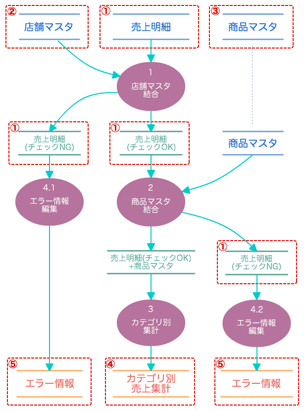
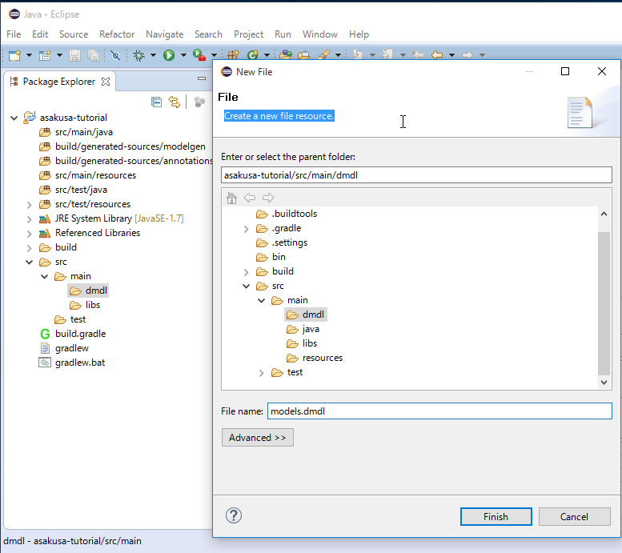
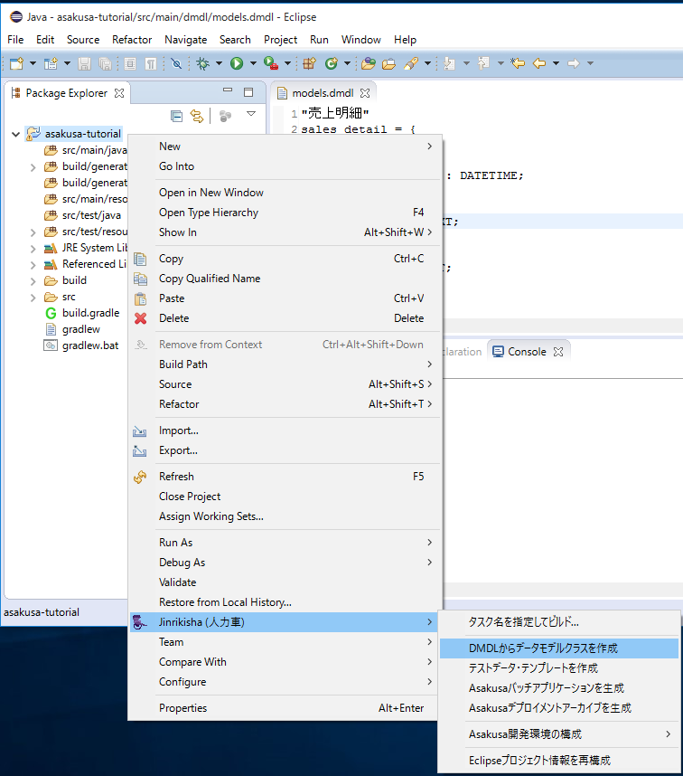
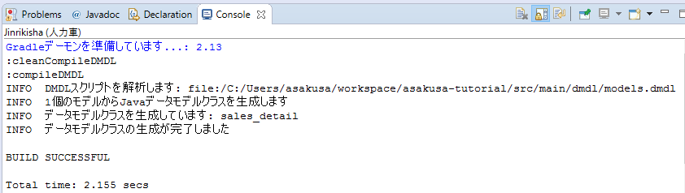

============================
DMDLによるデータモデルの定義
============================

このチュートリアルでは **DMDL** を利用してAsakusa Frameworkで利用する **データモデル** を定義する方法を説明していきます。

DMDLとは
========

DMDL(Data Model Definition Language)はAsakusa Frameworkで利用可能なデータモデルを定義するためのDSLです。

**DMDLスクリプト** というファイルにデータモデルの名前や構造を定義し、DMDLコンパイラを実行することで、定義したデータモデルに対応するJavaのプログラムを自動的に生成します。

DMDLから生成されるJavaプログラムは、バッチアプリケーションを構成する各プログラムの入出力データを保持したり、外部ファイルやデータベースとの連携を行う際のフォーマットを管理したりと、様々な用途に利用します。

このチュートリアルでは、前項の :doc:`example-app` で説明した :ref:`example-app-data-schema` の定義に従って、以下のデータモデルを作成していきます。

1. :ref:`example-app-data-schema-sales_detail`
2. :ref:`example-app-data-schema-store_info`
3. :ref:`example-app-data-schema-item_info`
4. :ref:`example-app-data-schema-category_summary`
5. :ref:`example-app-data-schema-error_record`

下図は、これらのデータモデルがデータフローのどこで使用されているかを示しています。

この図で示す通り、データモデルはバッチアプリケーションの入力データや出力データを保持したり、データフロー内の中間データを保持するために利用します。

なお、この図に対応がないデータモデルは後のチュートリアルで説明します。

DMDLスクリプトを作成する
========================

まず、DMDLを記述するためのテキストファイルであるDMDLスクリプトファイルを作成します。

DMDLスクリプトファイルはプロジェクトの :file:`src/main/dmdl` ディレクトリ以下に、拡張子 :file:`.dmdl` を持つファイルとして作成します。

このチュートリアルでは、 :file:`models.dmdl` というファイルを作成します。

作成したファイルをエディタで開きます。

..  seealso::
    DMDLスクリプトはEclipseに組み込まれている通常のテキストエディタで編集することができますが、DMDLの構文ハイライト機能などを提供するEclipseプラグイン「DMDL EditorX」を利用することもできます。

    DMDLエディタについては、 `関連ドキュメント`_ を参照してください。

DMDLスクリプトの構文
====================

DMDLスクリプトの基本的な構文を簡単に説明します。

データモデルの定義は、DMDLスクリプト内に以下のような形式で記述します。

..  code-block:: dmdl

    <データモデル名> = {
        <プロパティ名> : <プロパティ型>;
        <プロパティ名> : <プロパティ型>;
        ...
    };

    <データモデル名> = {
        <プロパティ名> : <プロパティ型>;
        <プロパティ名> : <プロパティ型>;
        ...
    };
    ...

* 「データモデル名」や「プロパティ名」は **小文字のアルファベット、数字、アンダースコア** のみを使用できます。
* データモデル定義のブロックやプロパティ定義行の末尾には **セミコロン** を指定します。
* 「プロパティ型」には次の型を指定できます。

..  list-table:: 利用可能なプロパティの型
    :widths: 3 7
    :header-rows: 1

    * - 型の名前
      - 説明
    * - ``INT``
      - 32bit符号付き整数
    * - ``LONG``
      - 64bit符号付き整数
    * - ``FLOAT``
      - 単精度浮動小数点
    * - ``DOUBLE``
      - 倍精度浮動小数点
    * - ``TEXT``
      - 文字列
    * - ``DECIMAL``
      - 10進数
    * - ``DATE``
      - 日付
    * - ``DATETIME``
      - 日時
    * - ``BOOLEAN``
      - 論理値
    * - ``BYTE``
      - 8bit符号付き整数
    * - ``SHORT``
      - 16bit符号付き整数

データモデルやプロパティの定義の直前の行に **ダブルクォートで囲んだ文字列** を指定することで「データモデルの説明」を記述することができます。

..  code-block:: dmdl

    "データモデルの説明"
    <データモデル名> = {

        "プロパティの説明"
        <プロパティ名> : <プロパティ型>;

        "プロパティの説明"
        <プロパティ名> : <プロパティ型>;
        ...
    };

なおプロパティ定義行の前後には任意の空行を挿入することもできます。

データモデルを定義する
======================

DMDLスクリプトファイルにデータモデルを定義していきます。

ここでは :doc:`example-app` で紹介した :ref:`example-app-data-schema`  のうち、 :ref:`example-app-data-schema-sales_detail` のデータモデルを定義する過程を説明していきます。

まず :file:`models.dmdl` に ``sales_detail`` というデータモデル名を持つデータモデル定義ブロックを記述します。

..  code-block:: dmdl
    :linenos:
    :caption: models.dmdl
    :name: models.dmdl-1-1

    sales_detail = {

    };

データモデル定義ブロック内にデータモデルのプロパティを追加していきます。

..  code-block:: dmdl
    :linenos:
    :caption: models.dmdl
    :name: models.dmdl-1-2

    sales_detail = {
        sales_date_time : DATETIME;
        store_code : TEXT;
        item_code : TEXT;
        amount : INT;
        unit_selling_price : INT;
        selling_price : INT;
    };

データモデル定義とプロパティ定義に説明を追加します。

..  code-block:: dmdl
    :linenos:
    :caption: models.dmdl
    :name: models.dmdl-1-3

    "売上明細"
    sales_detail = {

        "売上日時"
        sales_date_time : DATETIME;

        "店舗コード"
        store_code : TEXT;

        "商品コード"
        item_code : TEXT;

        "数量"
        amount : INT;

        "販売単価"
        unit_selling_price : INT;

        "販売金額"
        selling_price : INT;
    };

.. _dmdl-create-data-model-class:

データモデルクラスを生成する
============================

売上明細データモデルを定義したところで、このDMDLスクリプトからJavaのデータモデルクラスを作成してみましょう。

Eclipse上でデータモデルクラスを生成
-----------------------------------

Shafuを導入したEclipse環境では、コンテキストメニューからデータモデルクラスの生成を実行することができます。

1. プロジェクトを選択してコンテキストメニュー(右クリックなどで表示されるメニュー)を表示します。
2. コンテキストメニューの :guilabel:`Jinrikisha (人力車)` を選択し、サブメニューとして表示される :guilabel:`DMDLからデータモデルクラスを生成` を選択します。

3. 正常に終了すると、コンソールに以下のように ``BUILD SUCCESSFUL`` と出力されます。

生成されるデータモデルクラスについては、この後のチュートリアル :doc:`dmdl-4` で説明します。

コマンドライン上でデータモデルクラスを生成
------------------------------------------

コマンドライン上からデータモデルクラスを生成する場合は、Gradleの :program:`compileDMDL` タスクを実行します。

..  code-block:: sh

    ./gradlew compileDMDL

DMDLのコンパイルエラー
----------------------

データモデルクラスの生成に失敗した場合には、コンソールにエラーメッセージが表示され、生成処理が中断されます。

..  code-block:: none

    ERROR file:/C:/Users/asakusa/workspace/asakusa-tutorial/src/main/dmdl/models.dmdlの解析に失敗しました
    com.asakusafw.dmdl.parser.DmdlSyntaxException: DMDLスクリプトが正しくありません: 「";"」がおそらく必要です
    (場所: file:/C:/Users/asakusa/workspace/asakusa-tutorial/src/main/dmdl/models.dmdl:3:5)
    ...
    BUILD FAILED

生成に失敗する場合の多くは、記述したDMDLスクリプトに構文エラーがあることが原因です。
上記のエラーメッセージは、プロパティ定義の最後に ``;`` を指定し忘れた場合のエラーメッセージ例です。

..  code-block:: none
    :linenos:
    :caption: models.dmdl - 不正なデータモデルの例
    :name: models.dmdl-1-4

    sales_detail = {
        sales_date_time : DATETIME
        store_code : TEXT;
    };

エラーメッセージにはDMDLスクリプトが不正な原因とおおよその場所(原因のファイル名:行:列)が表示されます。
上記の例では3行目の5文字目、というように表示されていますが実際にはこの直前の行の末尾に ``;`` がないことが原因です。

エラー箇所を特定する場合はエラーメッセージの内容を手かがりに、その周辺に不正な記述がないかを確認するようにしてください。

レコードモデル
==============

DMDLでは、このチュートリアルで説明したようなデータモデル内にプロパティの一覧のみを持つデータモデルを **レコードモデル** と呼びます。
つまり先の手順では売上明細をレコードモデルとして定義したことになります。

次のチュートリアルでは、レコードモデル以外のデータモデル **結合モデル** , **集計モデル** について説明しますが、
その前に :doc:`example-app` の :ref:`example-app-data-schema` で説明した全てのデータモデルを定義しておきましょう。

:doc:`example-app` の :ref:`example-app-data-schema` に含まれる、 以下のデータ構造の定義をレコードモデルとして :file:`models.dmdl` に追加しましょう。

* :ref:`example-app-data-schema-store_info`
* :ref:`example-app-data-schema-item_info`
* :ref:`example-app-data-schema-category_summary`
* :ref:`example-app-data-schema-error_record`

終わりに
========

全てのデータモデルを定義した後にデータモデルクラスの生成を行い、5つのデータモデルの生成が成功していることをコンソールで確認してください。

このチュートリアル終了時点のDMDLスクリプト :file:`models.dmdl` は、次のようになります。

..  literalinclude:: dmdl-attachment/dmdl-1-finished-models.dmdl
    :language: dmdl
    :linenos:
    :caption: models.dmdl
    :name: models.dmdl-1-5

関連ドキュメント
================

* :asakusafw:`[Asakusa Framework documentation] - DMDLスタートガイド <dmdl/start-guide.html>`
* :asakusafw:`[Asakusa Framework documentation] - DMDLユーザーガイド <dmdl/user-guide.html>`
* :jinrikisha:`[Jinrikisha documentation] - DMDL Editorプラグイン <introduction/dmdl-editor.html>`

