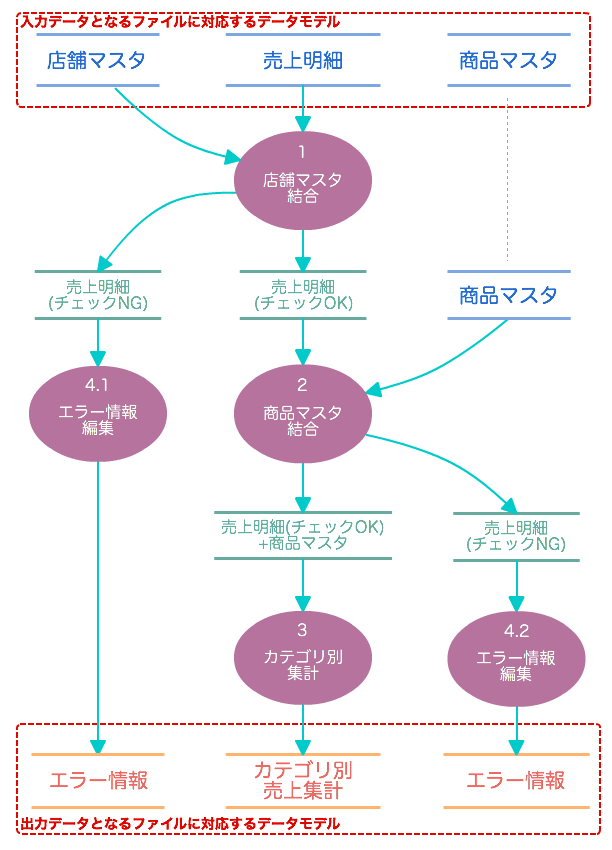

=====================
CSVフォーマットの定義
=====================

このチュートリアルでは **DMDL** を利用してAsakusa Frameworkで利用する **データモデル** を定義する方法を説明していきます。

:doc:`dmdl-2` の続きで、ここではバッチアプリケーションからCSVフォーマットのファイルを読み書きするための定義を追加していきます。

外部入出力に利用するデータモデル
================================

これまでのチュートリアルで6つのデータモデルを作成してきましたが、これらのデータモデルをその用途によって分類してみます。
:doc:`example-app` のデータフロー図も合わせて参考にしてください。

入力データとなるファイルに対応するデータモデル
  * :ref:`example-app-data-schema-sales_detail`
  * :ref:`example-app-data-schema-store_info`
  * :ref:`example-app-data-schema-item_info`

出力データとなるファイルに対応するデータモデル
  * :ref:`example-app-data-schema-category_summary`
  * :ref:`example-app-data-schema-error_record`

バッチ処理の処理途中のデータを格納するデータモデル
  * :ref:`example-app-data-schema-sales_detail`
  * :ref:`example-app-data-schema-joined_sales_info`

このうち「入力データとなるファイルに対応するデータモデル」と「出力データとなるファイルに対応するデータモデル」を外部入出力に利用するデータモデルとして利用します。

Asakusa Frameworkには、分散ファイルシステム上に配置したデータに対して **Direct I/O** というデータ入出力機能を利用してデータを読み書きすることができます。
このチュートリアルではDirect I/Oを使って上記のデータモデルに対応するCSVファイルを読み書きできるように定義していきます。

なお「バッチ処理の処理途中のデータを格納するデータモデル」はデータフロー内の中間データを保持するために利用するデータモデルです。
外部入出力に利用するデータモデルと区別するためにこれを「中間モデル」や「中間データモデル」などと呼ぶことがあります。

上図が示す通り、 :ref:`example-app-data-schema-sales_detail` は外部入力用のデータモデルと中間データモデルの２つの用途で使用しています。
また、 :ref:`example-app-data-schema-joined_sales_info` は中間データモデルとしてのみ使用するため、外部入出力用の定義は不要です。

Direct I/O CSVのフォーマット情報を定義する
==========================================

ここでは :ref:`example-app-data-schema-sales_detail` のデータモデルに対して、Direct I/O CSVのフォーマット情報定義を追加する過程を説明していきます。

データモデルをDirect I/O CSVと連携させるには対象となるデータモデル定義に ``@directio.csv`` 属性を指定します。

..  code-block:: dmdl
    :caption: models.dmdl
    :name: models.dmdl-3-1

    "売上明細"
    @directio.csv
    sales_detail = {
        ...
    };

``@directio.csv`` 属性には、CSVフォーマットに関する様々な設定を定義することができます。

前項の :doc:`example-app` - :ref:`example-app-data-format` では、CSVフォーマットについて以下のような仕様が定義されていました。

* 各CSVファイルの文字エンコーディングはUTF-8として扱う。
* 各CSVファイルの1行目は各項目の内容を示すヘッダとして扱い、実データとしては扱わない。
* 各CSVファイルの日付項目のフォーマットは ``yyyy-MM-dd``、日時項目のフォーマットは ``yyyy-MM-dd HH:mm:ss`` とする。

この仕様に沿って ``@directio.csv`` 属性にフォーマットに関する指定を追加します。

..  code-block:: dmdl
    :caption: models.dmdl
    :name: models.dmdl-3-2

    "売上明細"
    @directio.csv (
        charset = "UTF-8",
        has_header = TRUE,
        date = "yyyy-MM-dd",
        datetime = "yyyy-MM-dd HH:mm:ss"
    )
    sales_detail = {
        ...
    };

``@directio.csv`` 後ろに ``(...)`` で囲ったブロックを追加し、この中に設定項目の要素を定義します。要素間は ``,`` で区切ります。

``charset`` はファイルの文字エンコーディングを指定します。既定値は ``UTF-8`` であるため設定しなくても同じ動作になります。

``has_header`` を有効にすることで、1行目をヘッダとして扱います。
このオプションを有効にしている場合にデータモデルの各プロパティに対して ``@directio.csv.field`` 属性を指定することで以下のように動作します。

* ファイル入力時：指定したヘッダ名と入力ファイルが持つヘッダ名が一致するかをチェックする
* ファイル出力時：指定したヘッダ名で出力ファイルのヘッダを生成する

``date`` , ``datetime`` はそれぞれ ``DATE`` 型、 ``DATETIME`` 型の表現形式を指定します。

続けてデータモデルの各プロパティに対して ``@directio.csv.field`` 属性を追加して、ヘッダ名を指定します。

..  code-block:: dmdl
    :caption: models.dmdl
    :name: models.dmdl-3-3

    "売上明細"
    @directio.csv (
        charset = "UTF-8",
        has_header = TRUE,
        date = "yyyy-MM-dd",
        datetime = "yyyy-MM-dd HH:mm:ss"
    )
    sales_detail = {

      "売上日時"
      @directio.csv.field(name = "日時")
      sales_date_time : DATETIME;

      "店舗コード"
      @directio.csv.field(name = "店舗コード")
      store_code : TEXT;

      ...
    };

また ``@directio.csv.file_name`` 属性を指定したプロパティは、ファイル入力時のファイル名を格納します。

..  code-block:: dmdl
    :caption: models.dmdl
    :name: models.dmdl-3-4

    sales_detail = {
      ...

      "ファイル名"
      @directio.csv.file_name
      file_name : TEXT;
    };

今回のアプリケーションでは、入力となる売上明細のファイル名をデータモデルとして保持しておき、
売上明細のエラーチェック時に、該当したレコードが含まれるファイル名をエラー情報に受け渡します。

なお、この属性を指定したプロパティはCSVフィールドとしては扱われないため、
CSVファイルフォーマットに関係なく入力ファイル名を保持することができます。

:ref:`example-app-data-schema-sales_detail` の最終的なデータモデル定義は、以下のようになります。

..  literalinclude:: dmdl-attachment/dmdl-3-finished-models.dmdl
    :language: dmdl
    :caption: models.dmdl
    :name: models.dmdl-3-5
    :lines: 1-35

同様の手順で ``models.dmdl`` に含まれる以下のデータモデルにDirect I/O CSVのフォーマット情報を定義しましょう。

* :ref:`example-app-data-schema-store_info`
* :ref:`example-app-data-schema-item_info`
* :ref:`example-app-data-schema-category_summary`
* :ref:`example-app-data-schema-error_record`

終わりに
========

全てのデータモデルを定義した後にデータモデルクラスの生成を行い、6つのデータモデルの生成が成功していることをコンソールで確認してください。

このチュートリアル終了時点のDMDLスクリプト :file:`models.dmdl` は、次のようになります。

..  literalinclude:: dmdl-attachment/dmdl-3-finished-models.dmdl
    :language: dmdl
    :linenos:
    :caption: models.dmdl
    :name: models.dmdl-3-6

関連ドキュメント
================

* :asakusafw:`[Asakusa Framework documentation] - Direct I/OのCSVファイル連携 <directio/csv-format.html>`

