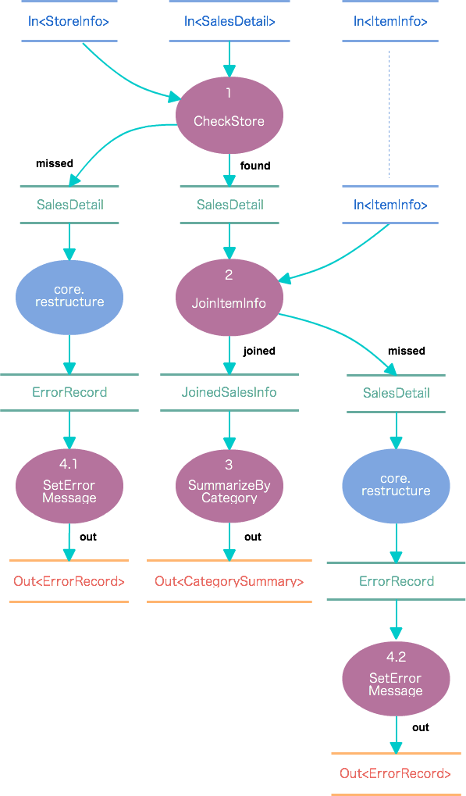
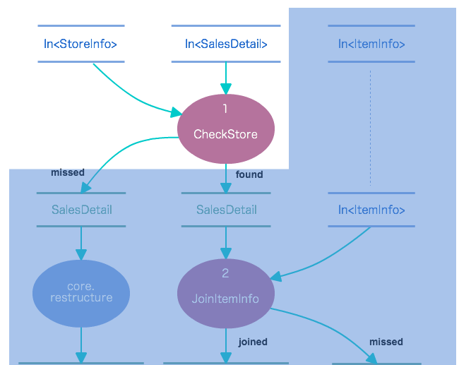
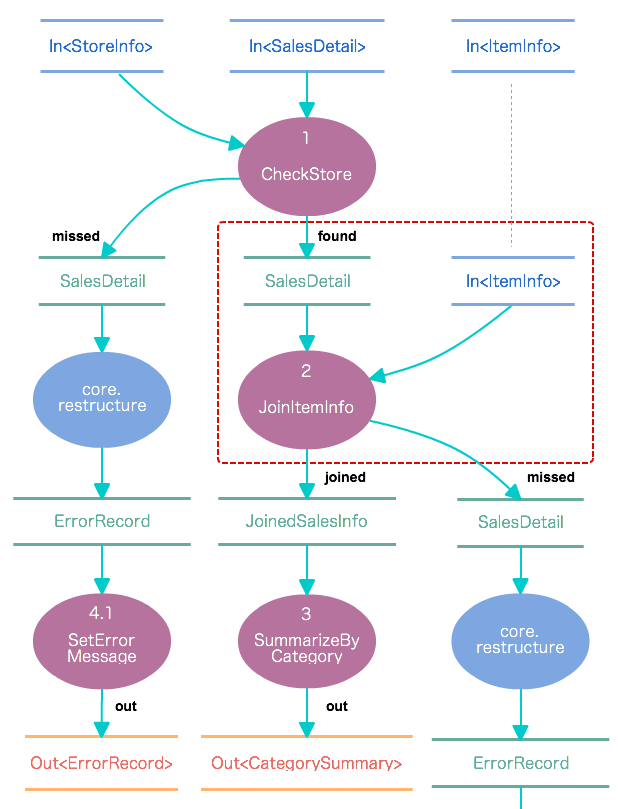
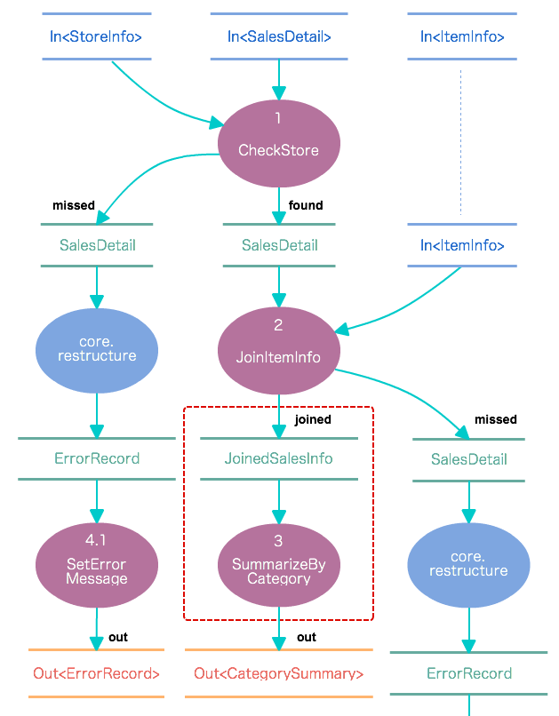
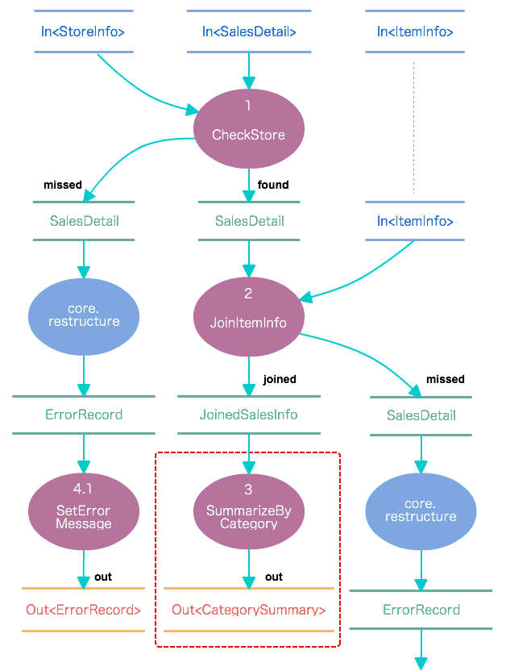
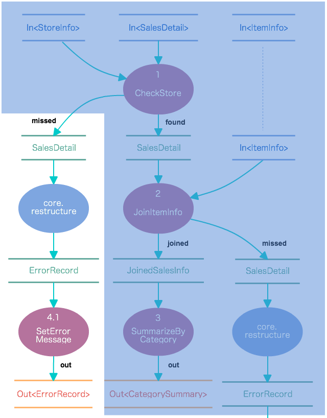

================
フロー部品の作成
================

このチュートリアルでは、バッチアプリケーションのデータフローを定義する **フロー部品** を作成する方法を説明していきます。

.. _dsl-flowpart-flow-dsl:

データフローとFlow DSL
======================

Asakusa Frameworkでは演算子と呼ばれる処理の単位をデータフローの形式で組み合わせて処理を記述します。
このチュートリアルではデータフローの作成について説明していきます。

データフローは、Askausaが提供する **Flow DSL** を使って記述します。
Flow DSLでは演算子を組み合わせたデータフローの構造を非循環有向グラフ (Directed Acyclic Graph: DAG) の形式で記述します。

Flow DSLで記述できる構造は以下の2種類あり、それぞれ異なる性質を持ちます。

フロー部品
  データフローそのものを演算子として定義する。つまり、演算子を組み合わせてより大きな演算子を構築する。
  ここで記述したデータフローは、ジョブフローやフロー部品から演算子として利用できる。

ジョブフロー
  外部システムからデータを取り出して、外部システムにデータを書き出すデータフロー。
  データフローの入出力にはそれぞれ外部システム（ファイルやデータベースなど）と連携する方法を記述する。
  また、ジョブフローにフロー部品で記述するようなデータフローを直接定義することも可能。

バッチアプリケーションを構成する要素して、ジョブフローは必須となりますが、フロー部品は必ずしも必要ありません。
データフローはフロー部品とジョブフローで同じように記述することが可能であるためです。
ですが、フロー部品を作成することには多くのメリットがあります。

このチュートリアルではフロー部品とジョブフローの両方を作成します。
フロー部品でバッチアプリケーションのデータフロー部分を作成し、
ジョブフローでこのデータフローに対して外部入出力（このチュートリアルではCSVファイルに対する入出力）の定義を行い、フロー部品と外部入出力を連携します。

フロー部品の作成に入る前に、まずはジョブフローとフロー部品の違いやフロー部品を利用することのメリットを説明します。

.. _dsl-flowpart-jobflow-flowpart:

フロー部品とジョブフロー
========================

ここではフロー部品とジョブフローとの違いを見ていきます。

まず、Asakusa Frameworkのデータフロー構造は以下の3種類の構成要素からなります。

外部入力の定義
  バッチアプリケーションの入力データをどのようにして外部システムから取り込むかを定義します。
  データソースの種類（ファイルやデータベース）、データモデルの種類や想定されるデータサイズ、データの配置場所やフィルタルールなどの指定を行います。

外部出力の定義
  バッチアプリケーションの出力データをどのようにして外部システムに書き戻すかを定義します。
  データソースの種類（ファイルやデータベース）、データモデルの種類、データの配置場所やフィルタルールなどの指定を行います。

データフローの定義
  演算子を組み合わせて一連のデータ処理の流れを定義します。
  ジョブフローではこれに加えて、外部入力と演算子の流れ、および演算子と外部出力の流れも記述します。

このうちフロー部品は「データフローの定義」のみを記述することができます。
さらに、データフローの定義の中でも「演算子と演算子の組み合わせ」のみを記述することが可能で、
「外部入力と演算子の流れ」「演算子と外部出力の流れ」を記述することはできません。

フロー部品がジョブフローと異なる重要な点として、 **フロー部品は演算子として利用可能** であるという点があります。

フロー部品は名前のとおり「データフローの部品」を定義する構造です。
ここで定義したデータフローは、ほかのデータフローから「フロー演算子」とよばれる演算子として利用できます。

フロー演算子はジョブフローから利用することはもちろんのこと、フロー部品から利用することもできるため、複雑なデータフローを階層化して取り扱うことが可能になります。

その他にフロー部品は「値引数を利用できる」という点も異なります。
:doc:`dsl-operator-1` で演算子の値引数について説明しましたが、同様の仕組みをフロー部品でも利用することができます。
一部の値のみが異なる複数のデータフローをフロー部品として抽出すると、データフローの再利用性が高まります。

上記のような仕組みにより、フロー部品を活用することでコンポーネントの独立性を保ち、適切な粒度での構造化を促し再利用性やテスト容易性を高めるといったことが期待できます。
特に大規模で複雑なバッチアプリケーションにおいては、このメリットが大きくなるでしょう。

.. _example-app-dataflow-dsl:

データフロー図
==============

:doc:`example-app` - :ref:`example-app-dataflow` では、このチュートリアルで作成するアプリケーションのデータフロー図を示しました。

このデータフロー図に対して、Operator DSLとFlow DSLの情報をマッピングしたデータフロー図を以下に示します。
Flow DSLについてはこのチュートリアルでこれから説明するので、今この図で不明な点があっても問題ありません。

このデータフロー図は、 :doc:`example-app` - :ref:`example-app-dataflow` をベースにして以下の通りに編集を行いました。

1. データフローの入力と出力に対して、データモデルの情報をマッピング

  * 青の長方形（入力）、橙の長方形（出力）で表記するデータフローの入出力項目に、Flow DSLで利用する入出力オブジェクトの情報を記述。
     * 例: ``In<SalesDetail>`` , ``Out<CategorySummary>``
  * 緑の長方形で表記するデータフロー内の各入出力データ項目に、に、データモデルクラスの情報を記載。
     * 例: ``SalesDetail`` , ``JoinedSalesInfo``

2. データフローの各処理に対して、演算子の情報をマッピング

  * 紫の円形で表記する各プロセスの項目に、Flow DSLで利用する演算子オブジェクトクラスの情報を記述
      * 例: ``CheckStore`` , ``JoinItemInfo``
  * 演算子の出力側の矢印上に、演算子の出力を表す「ポート」の情報を記述
      * 例: ``found`` , ``missed`` , ``out``

3. Flow DSLの実装に合わせたデータフローの詳細化

  * 青の円形で表記するコア演算子の処理を追加。
      * 例: ``core.restructure`` を使った、データモデル ``SalesDetail`` 型の ``ErrorRecord`` 型への変換

以降ではフロー部品を実装していきますが、適宜この図を参照してフロー部品における各要素の関係を確認するとよいでしょう。

フロー部品クラスを作成する
==========================

フロー部品を構築するためのクラスを **フロー部品クラス** と呼びます。

フロー部品クラスはプロジェクトのソースフォルダ ``src/main/java`` 配下に任意のJavaパッケージ名とクラス名を持つクラスとして作成できます。
ここでは、以下のようにフロー部品クラスを作成します。

..  list-table::
    :widths: 2 5

    * - パッケージ名
      - ``com.example.flowpart``
    * - クラス名
      - ``CategorySummaryFlowPart``

フロー部品クラスは、以下のように宣言します。

* ``public`` スコープを指定したクラスとして作成する
* Flow DSL用の親クラス ``FlowDescription`` [#]_ を継承する
* フロー部品クラスであることを示す注釈 ``FlowPart`` [#]_ を指定する。

``FlowDescription`` を継承したクラスは抽象メソッド ``describe`` を実装する必要があります。
``describe`` メソッドの実装については後述の `フロー記述メソッドを作成する`_ で説明しますが、ここではとりあえず空のメソッドを定義しておきます。

作成したフロー部品クラスは、以下のようになります。

..  code-block:: java
    :caption: CategorySummaryFlowPart.java
    :name: CategorySummaryFlowPart.java-1

    package com.example.flowpart;

    import com.asakusafw.vocabulary.flow.FlowDescription;
    import com.asakusafw.vocabulary.flow.FlowPart;

    @FlowPart
    public class CategorySummaryFlowPart extends FlowDescription {

        @Override
        protected void describe() {

        }

    }

..  [#] :javadoc:`com.asakusafw.vocabulary.flow.FlowDescription`
..  [#] :javadoc:`com.asakusafw.vocabulary.flow.FlowPart`

フロー部品コンストラクタを作成する
==================================

フロー部品クラスのコンストラクタには、このフロー部品が扱うデータフローの入出力とデータモデルクラスの指定を行います。

このフロー部品では、 :doc:`dmdl-4` - :ref:`dmdl-data-model-class` で作成したデータモデルクラスを次のように利用します。

* データフローの入力

  * ``SalesDetail``
  * ``StoreInfo``
  * ``ItemInfo``
* データフローの出力

  * ``CategorySummary``
  * ``ErrorRecord``

これに基づいて作成したフロー部品コンストラクタは、以下のようになります。

..  code-block:: java
    :caption: CategorySummaryFlowPart.java
    :name: CategorySummaryFlowPart.java-2

    ...
    import com.asakusafw.vocabulary.flow.In;
    import com.asakusafw.vocabulary.flow.Out;
    import com.example.modelgen.dmdl.model.CategorySummary;
    import com.example.modelgen.dmdl.model.ErrorRecord;
    import com.example.modelgen.dmdl.model.ItemInfo;
    import com.example.modelgen.dmdl.model.SalesDetail;
    import com.example.modelgen.dmdl.model.StoreInfo;

    @FlowPart
    public class CategorySummaryFlowPart extends FlowDescription {

        final In<SalesDetail> salesDetail;
        final In<StoreInfo> storeInfo;
        final In<ItemInfo> itemInfo;
        final Out<CategorySummary> categorySummary;
        final Out<ErrorRecord> errorRecord;

        public CategorySummaryFlowPart(
                In<SalesDetail> salesDetail,
                In<StoreInfo> storeInfo,
                In<ItemInfo> itemInfo,
                Out<CategorySummary> categorySummary,
                Out<ErrorRecord> errorRecord) {
            this.salesDetail = salesDetail;
            this.storeInfo = storeInfo;
            this.itemInfo = itemInfo;
            this.categorySummary = categorySummary;
            this.errorRecord = errorRecord;
        }
        ...
    }

まず、フロー部品クラスにデータフローの入出力オブジェクトを保持するためのインスタンスフィールドを作成します。

..  code-block:: java
    :caption: CategorySummaryFlowPart.java
    :name: CategorySummaryFlowPart.java-3

    final In<SalesDetail> salesDetail;
    final In<StoreInfo> storeInfo;
    final In<ItemInfo> itemInfo;
    final Out<CategorySummary> categorySummary;
    final Out<ErrorRecord> errorRecord;

``In`` [#]_ 型のオブジェクトは、このデータフローへの1つ分の入力を表します。型引数には入力となるデータモデルクラス型を指定します。
同様に、 ``Out`` [#]_ 型のオブジェクトは、このデータフローへの1つ分の出力を表します。型引数には出力となるデータモデルクラス型を指定します。

..  [#] :javadoc:`com.asakusafw.vocabulary.flow.In`
..  [#] :javadoc:`com.asakusafw.vocabulary.flow.Out`

コンストラクタでは、仮引数にこのフロー部品が受け取る入力と出力を宣言します。

..  code-block:: java
    :caption: CategorySummaryFlowPart.java
    :name: CategorySummaryFlowPart.java-4

    public CategorySummaryFlowPart(
            In<SalesDetail> salesDetail,
            In<StoreInfo> storeInfo,
            In<ItemInfo> itemInfo,
            Out<CategorySummary> categorySummary,
            Out<ErrorRecord> errorRecord) {
        ...

コンストラクタの本体では、引数で受け取った入力と出力をインスタンスフィールドに代入します。

..  code-block:: java
    :caption: CategorySummaryFlowPart.java
    :name: CategorySummaryFlowPart.java-5

            ...
            Out<ErrorRecord> errorRecord) {
        this.salesDetail = salesDetail;
        this.storeInfo = storeInfo;
        this.itemInfo = itemInfo;
        this.categorySummary = categorySummary;
        this.errorRecord = errorRecord;
    }

フロー部品コンストラクタは通常のクラスに比べると少し独特かもしれませんが、記述内容自体は単純なものなので、仕組みを理解すれば簡単に記述できると思います。

.. _dsl-flowpart-create-describe:

フロー記述メソッドを作成する
============================

データフローの処理内容は、フロー記述メソッド ``describe`` に記述します。

..  code-block:: java
    :caption: CategorySummaryFlowPart.java
    :name: CategorySummaryFlowPart.java-6

    @Override
    protected void describe() {

    }

このメソッドの中にはコンストラクタに指定した入出力オブジェクトや演算子オブジェクトを接続して、データフローを構築するプログラムを記述していきます。

フロー記述メソッド内で演算子を利用するには :doc:`dsl-operator-2` で説明した以下のクラスやメソッドを利用します。

* :ref:`dsl-operator-factory-class`
* :ref:`dsl-operator-factory-method`
* :ref:`dsl-operator-object-class`

演算子ファクトリを用意する
--------------------------

フロー記述メソッド内で演算子を利用するには、まず演算子のビルド結果として生成された :ref:`dsl-operator-factory-class` をインスタンス化します。

:doc:`dsl-operator-2` で説明したように、演算子ファクトリは演算子クラス名の末尾に ``Factory`` をつけた名前で生成されます。
ここでは演算子ファクトリ ``CategorySummaryOperatorFactory`` をインスタンス化します。

またAsakusa Frameworkでは ``CoreOperatorFactory`` [#]_ という組み込みの演算子ファクトリを提供しています。
``CoreOperatorFactory`` からは **コア演算子** と呼ばれる組み込みの演算子を利用することができます。
この演算子ファクトリも合わせてインスタンス化します。

..  code-block:: java
    :caption: CategorySummaryFlowPart.java
    :name: CategorySummaryFlowPart.java-7

    ...
    import com.asakusafw.vocabulary.flow.util.CoreOperatorFactory;
    import com.example.operator.CategorySummaryOperatorFactory;
    ...

    @Override
    protected void describe() {
        CoreOperatorFactory core = new CoreOperatorFactory();
        CategorySummaryOperatorFactory operators = new CategorySummaryOperatorFactory();
    }

..  [#] :javadoc:`com.asakusafw.vocabulary.flow.util.CoreOperatorFactory`

入力と演算子を接続する
----------------------

ここからはデータフロー本体の内容を記述します。データフロー全体の流れは :ref:`example-app-dataflow-dsl` も参考にしてください。

まずデータフローの最初の処理となる、商品マスタと売上明細を結合して売上明細のチェックを行うマスタ確認演算子 ``checkStore`` を実行するデータフローを記述します。

..  code-block:: java
    :caption: CategorySummaryFlowPart.java
    :name: CategorySummaryFlowPart.java-8
    :emphasize-lines: 14-15

    ...
    import com.example.operator.CategorySummaryOperatorFactory.CheckStore;
    ...

    final In<SalesDetail> salesDetail;
    final In<StoreInfo> storeInfo;
    ...

    @Override
    protected void describe() {
        CoreOperatorFactory core = new CoreOperatorFactory();
        CategorySummaryOperatorFactory operators = new CategorySummaryOperatorFactory();

        // 1. 店舗マスタ結合
        CheckStore checkStore = operators.checkStore(storeInfo, salesDetail);

    }

演算子ファクトリ ``operators`` に対して :ref:`dsl-operator-factory-method` ``checkStore`` を呼び出し、引数にフロー部品コンストラクタで受け取った ``In`` 型を持つ入力オブジェクト ``storeInfo`` , ``salesDetail`` を指定しています。

このように、演算子ファクトリメソッドに対して、対応するデータモデルクラス型を持つ入力オブジェクト [#]_ を指定して呼び出すことで、演算子ファクトリメソッドと同じ名前の演算子メソッドを実行することになります。

戻り値には、演算子メソッドに対応する :ref:`dsl-operator-object-class` 型のオブジェクトが返却されます。
演算子オブジェクトがもつ **出力ポート** を利用して、この演算子と次に実行する演算子、または出力に対するデータフローを定義します。

..  [#] 演算子クラスから生成される演算子ファクトリメソッドの引数型は ``Source`` [#]_ 型です。ここで指定している ``In`` 型は ``Source`` 型を継承したインターフェースのため、引数に指定することが可能です。
..  [#] :javadoc:`com.asakusafw.vocabulary.flow.Source`

演算子と演算子を接続する
------------------------

では次に、マスタ確認演算子 ``checkStore`` の出力結果である「マスタチェックがOKであった売上明細」に対して、 商品マスタを結合するマスタ結合演算子 ``joinItemInfo`` を実行するデータフローを記述します。

..  code-block:: java
    :caption: CategorySummaryFlowPart.java
    :name: CategorySummaryFlowPart.java-9
    :emphasize-lines: 16-17

    ...
    import com.example.operator.CategorySummaryOperatorFactory.JoinItemInfo;
    ...

    final In<ItemInfo> itemInfo;
    ...

    @Override
    protected void describe() {
        CoreOperatorFactory core = new CoreOperatorFactory();
        CategorySummaryOperatorFactory operators = new CategorySummaryOperatorFactory();

        // 1. 店舗マスタ結合
        CheckStore checkStore = operators.checkStore(storeInfo, salesDetail);

        // 2. 商品マスタ結合
        JoinItemInfo joinItemInfo = operators.joinItemInfo(itemInfo, checkStore.found);

    }

`入力と演算子を接続する`_ と同様にして、演算子ファクトリ ``operators`` に対して :ref:`dsl-operator-factory-method` ``joinItemInfo`` を呼び出しています。
第1引数は `入力と演算子を接続する`_ と同様に、フロー部品コンストラクタで受け取った ``In`` 型を持つ入力オブジェクト ``itemInfo`` を指定しています。
第2引数は演算子オブジェクト ``checkStore`` がもつメンバー ``found`` を指定しています。

この出力ポート ``found`` は演算子の処理を実行した結果である出力を表しています。
演算子オブジェクトはそれぞれその演算子の出力を表すポートを持っていて、このポートを演算子ファクトリメソッドに引き渡すことで、
演算子と演算子のデータフロー関係が構築されます。

演算子オブジェクトが持つポートの種類は、演算子の種類や演算子の実装方法などによって決定されます。
例えば、 マスタ確認演算子 ``checkStore``  は結合の結果マスタが見つかったトランザクションデータを表すポート ``found`` と、
マスタが見つからなかったトランザクションデータを表すポート ``missed`` を持ちます。

ポートは ``Source`` 型をオブジェクトで型引数には演算子メソッドの定義に従ったデータモデル型が定義されています。
演算子ファクトリメソッドにポートを引き渡す際にはこれらのデータモデル型が一致している必要があります。

..  seealso::
    各演算子が持つポートの情報は、演算子リファレンス（ `関連ドキュメント`_ ）に記載されています。

それでは引き続きデータフローの構築をおこなっていきましょう。
次はマスタ結合演算子 ``joinItemInfo`` の出力結果である結合モデルに対して、 カテゴリ別に集計を行う単純集計演算子 ``summarizeByCategory`` を実行するデータフローを記述します。

..  code-block:: java
    :caption: CategorySummaryFlowPart.java
    :name: CategorySummaryFlowPart.java-10
    :emphasize-lines: 16-17

    ...
    import com.example.operator.CategorySummaryOperatorFactory.SummarizeByCategory;
    ...

    @Override
    protected void describe() {
        CoreOperatorFactory core = new CoreOperatorFactory();
        CategorySummaryOperatorFactory operators = new CategorySummaryOperatorFactory();

        // 1. 店舗マスタ結合
        CheckStore checkStore = operators.checkStore(storeInfo, salesDetail);

        // 2. 商品マスタ結合
        JoinItemInfo joinItemInfo = operators.joinItemInfo(itemInfo, checkStore.found);

        // 3. カテゴリ別集計
        SummarizeByCategory summarize = operators.summarizeByCategory(joinItemInfo.joined);

    }

マスタ結合演算子は、 結合結果である結合モデルを出力するポート ``joined`` を持ちます。
これを次に実行する演算子に対応する演算子ファクトリメソッドに引き渡します。

このようにして、演算子と演算子の関係を定義してデータフローを構築していきます。

演算子と出力を接続する
----------------------

ここまでで演算子と演算子の関係を定義してデータフローを構築してきましたが、データフローの最後にはこれをデータフローの出力と接続します。

ここでは、単純集計演算子 ``summarizeByCategory`` の出力結果である集計モデルに対して、 これをデータフローの出力として定義するデータフローを記述します。

..  code-block:: java
    :caption: CategorySummaryFlowPart.java
    :name: CategorySummaryFlowPart.java-11
    :emphasize-lines: 19-20

    ...
    final Out<CategorySummary> categorySummary;
    ...

    @Override
    protected void describe() {
        CoreOperatorFactory core = new CoreOperatorFactory();
        CategorySummaryOperatorFactory operators = new CategorySummaryOperatorFactory();

        // 1. 店舗マスタ結合
        CheckStore checkStore = operators.checkStore(storeInfo, salesDetail);

        // 2. 商品マスタ結合
        JoinItemInfo joinItemInfo = operators.joinItemInfo(itemInfo, checkStore.found);

        // 3. カテゴリ別集計
        SummarizeByCategory summarize = operators.summarizeByCategory(joinItemInfo.joined);

        // カテゴリ別売上集計の出力
        categorySummary.add(summarize.out);

    }

演算子の処理結果をデータフローの出力に定義するには、フロー部品コンストラクタで受け取った ``Out`` 型を持つ出力オブジェクトの ``add()`` メソッドの引数に、それぞれの演算子の出力ポートを渡します。
このようにすることで、その演算子の出力がデータフローの出力となります。

ここでは出力オブジェクト ``categorySummary`` が持つ単純集計演算子の出力ポート ``out`` を引き渡すことで、``categorySummary`` の集計結果をデータフローの出力としています。

フロー部品やジョブフローでは、各コンストラクタで定義したすべての出力オブジェクトに対してデータフローの接続を指定する必要があります。
接続関係が定義されていない出力が残っている場合は、正しくバッチアプリケーションを生成することができません。

ここで作成しているフロー部品は ``Out<CategorySummary> categorySummary`` , ``Out<ErrorRecord> errorRecord`` という2つの出力を定義したので、
ここまでの手順ではまだ出力オブジェクト ``errorRecord`` に対するデータフローを構築する作業が残っています。

引き続き出力 ``errorRecord`` に対するデータフローを構築していきましょう。

コア演算子を利用する
--------------------

出力 ``errorRecord`` に対するデータの流れは、以下の2つがあります。

1. マスタ確認演算子 ``checkStore`` でマスタが見つからなかった売上明細に対して、更新演算子 ``setErrorMessage`` を実行してエラー情報を付加し、これをデータフローの出力とする。
2. マスタ結合演算子 ``joinItemInfo`` でマスタが見つからなかった売上明細に対して、更新演算子 ``setErrorMessage`` を実行してエラー情報を付加し、これをデータフローの出力とする。

ここでも `演算子と演算子を接続する`_ と同様の方法でデータフローの構築を行いたいところですが、
これらの演算子の関係では、以下のようにデータモデル型が一致していないという問題があります。

..  list-table::
    :widths: 2 1

    * - ``checkStore`` , ``joinItemInfo`` の出力
      - ``SalesDetail``
    * - ``setErrorMessage`` の入力
      - ``ErrorRecord``

このような場合、データモデル型を変更する演算子を利用することで柔軟にデータフローを構築することができる場合があります。

1つ目のデータフローから見ていきます。

..  code-block:: java
    :caption: CategorySummaryFlowPart.java
    :name: CategorySummaryFlowPart.java-12
    :emphasize-lines: 25-29

    ...
    import com.example.operator.CategorySummaryOperatorFactory.SetErrorMessage;
    ...

    final Out<ErrorRecord> errorRecord;
    ...

    @Override
    protected void describe() {
        CoreOperatorFactory core = new CoreOperatorFactory();
        CategorySummaryOperatorFactory operators = new CategorySummaryOperatorFactory();

        // 1. 店舗マスタ結合
        CheckStore checkStore = operators.checkStore(storeInfo, salesDetail);

        // 2. 商品マスタ結合
        JoinItemInfo joinItemInfo = operators.joinItemInfo(itemInfo, checkStore.found);

        // 3. カテゴリ別集計
        SummarizeByCategory summarize = operators.summarizeByCategory(joinItemInfo.joined);

        // カテゴリ別売上集計の出力
        categorySummary.add(summarize.out);

        // 4.1. エラー情報編集（店舗）
        SetErrorMessage unknownStore = operators.setErrorMessage(
            core.restructure(checkStore.missed, ErrorRecord.class), "店舗不明");
        // エラー情報の出力（店舗）
        errorRecord.add(unknownStore.out);

    }

マスタ確認演算子 ``checkStore`` の実行結果のうち、マスタが見つからなかったトランザクションデータを表すポート ``missed`` を入力としてエラー情報を編集する更新演算子 ``setErrorMessage`` を実行しています。

このとき、``checkStore.missed`` で取得される ``SalesDetail`` 型のデータモデルを再構築演算子 ``core.restucture`` を利用して、データモデル型を ``ErrorRecord`` 型に変換しています。

再構築演算子はコア演算子に分類される演算子の1つで、レコードの内容を別の型に移し替える演算子です。
変換元の型と変換先の型に共通するプロパティをコピーします。

このようにコア演算子は汎用的なデータモデル型の変換やデータフローの制御を行うためのいくつかの演算子を提供しています。

2つ目のデータフローも同様に定義します。

..  figure:: images/example-app-dataflow-dsl-op4-2.png
    :width: 75%

..  code-block:: java
    :caption: CategorySummaryFlowPart.java
    :name: CategorySummaryFlowPart.java-13
    :emphasize-lines: 31-35

    ...
    import com.example.operator.CategorySummaryOperatorFactory.SetErrorMessage;
    ...

    final Out<ErrorRecord> errorRecord;
    ...

    @Override
    protected void describe() {
        CoreOperatorFactory core = new CoreOperatorFactory();
        CategorySummaryOperatorFactory operators = new CategorySummaryOperatorFactory();

        // 1. 店舗マスタ結合
        CheckStore checkStore = operators.checkStore(storeInfo, salesDetail);

        // 2. 商品マスタ結合
        JoinItemInfo joinItemInfo = operators.joinItemInfo(itemInfo, checkStore.found);

        // 3. カテゴリ別集計
        SummarizeByCategory summarize = operators.summarizeByCategory(joinItemInfo.joined);

        // カテゴリ別売上集計の出力
        categorySummary.add(summarize.out);

        // 4.1. エラー情報編集（店舗）
        SetErrorMessage unknownStore = operators.setErrorMessage(
            core.restructure(checkStore.missed, ErrorRecord.class), "店舗不明");
        // エラー情報の出力（店舗）
        errorRecord.add(unknownStore.out);

        // 4.2. エラー情報編集（商品）
        SetErrorMessage unknownItem = operators.setErrorMessage(
            core.restructure(joinItemInfo.missed, ErrorRecord.class), "商品不明");
        // エラー情報の出力（商品）
        errorRecord.add(unknownItem.out);
    }

演算子ファクトリメソッド ``setErrorMessage`` の第2引数には ``"店舗不明"`` や ``"商品不明"`` のように文字列を指定して演算子を呼び出しています。
これは値引数を指定してデータフローから演算子を呼び出す例です。

ここではデータフローごとに同じ演算子を利用しつつ異なるエラー情報を設定するために、値引数を使ってそれぞれのデータフローに固有の値を設定しています。
このように値引数を利用することで、演算子の実装を再利用しつつデータフローごとに異なる処理を行うことができるようになります。

終わりに
========

このチュートリアル終了時点のフロー部品クラス :file:`CategorySummaryFlowPart.java` は、次のようになります。

..  literalinclude:: dsl-attachment/CategorySummaryFlowPart.java
    :language: java
    :linenos:
    :caption: CategorySummaryFlowPart.java
    :name: CategorySummaryFlowPart.java-all

関連ドキュメント
================

* :asakusafw:`[Asakusa Framework documentation] - Asakusa DSLスタートガイド <dsl/start-guide.html>`
* :asakusafw:`[Asakusa Framework documentation] - Asakusa DSLユーザーガイド <dsl/user-guide.html>`
* :asakusafw:`[Asakusa Framework documentation] - 演算子リファレンス <dsl/operators.html>`

