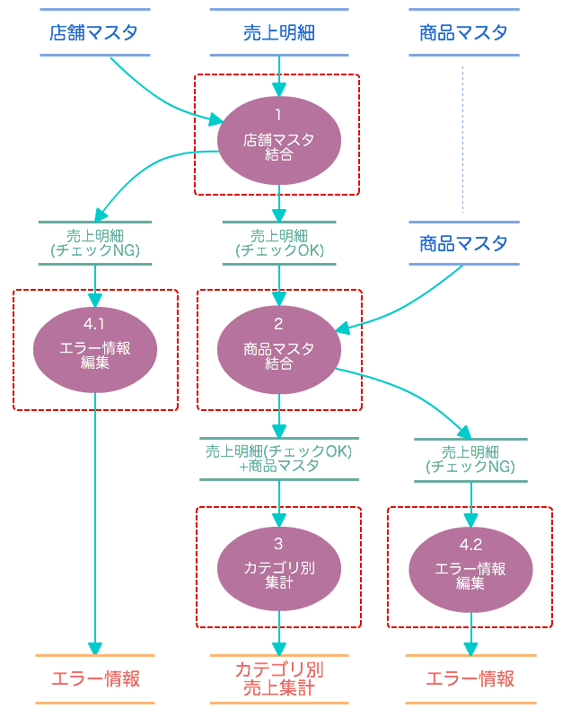
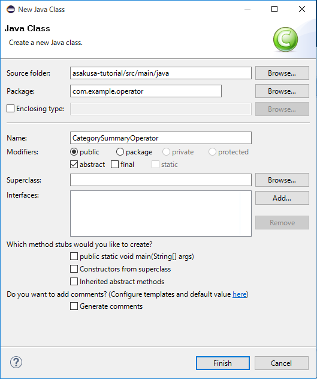

============
演算子の作成
============

このチュートリアルでは、バッチアプリケーションを構成する処理の単位となる **演算子** を作成する方法を説明していきます。

演算子とOperator DSL
====================

Asakusa Frameworkでは演算子と呼ばれる処理の単位をデータフローの形式で組み合わせて処理を記述します。
このチュートリアルでは演算子の作成について説明していきます。
データフローの作成は後のチュートリアル :doc:`dsl-flowpart-1` で説明します。

演算子は、Askausaが提供する **Operator DSL** を使って記述します。
Operator DSLは基本的には通常のJavaのクラスやメソッドと同じように記述します。

演算子クラス
  演算子を保持するクラス。
  演算子クラスの中に作成する **演算子メソッド** が演算子の単位となる。

演算子メソッド
  演算子の処理を記述するためのメソッド。
  演算子の種類ごとに用意された注釈 **演算子注釈** を指定することで、そのメソッドが演算子として扱われる。

演算子には、データの編集方法や受け取るデータの単位などに応じた様々な種類があります。
このチュートリアルでは以下の演算子を利用します。

.. _dsl-operator-using-operators:

..  list-table:: チュートリアルで使用する演算子の種類
    :widths: 2 2 6
    :header-rows: 1

    * - 名前
      - 注釈/メソッド
      - 概要
    * - マスタ確認演算子
      - ``MasterCheck``
      - レコードとマスタデータを結合して、存在する場合としない場合で出力を振り分ける
    * - マスタ結合演算子
      - ``MasterJoin``
      - レコードにマスタデータを結合して、結合したデータモデルを出力する
    * - 単純集計演算子
      - ``Summarize``
      - グループ化したレコードを集計して出力する
    * - 更新演算子
      - ``Update``
      - レコードの内容を更新して出力する
    * - 再構築演算子
      -  ``restructure``
      - レコードの内容を別の型に移し替える

..  seealso::
    Asakusa Frameworkが提供するすべての演算子とその使い方は「演算子リファレンス」（ `関連ドキュメント`_ ）に記載されています。

演算子によってはメソッド内の処理を実装する必要がないものや、データフロー内でフレームワークが提供する演算子用のAPIを直接利用する、といったものもあります。

それぞれの演算子では、DMDLスクリプトから作成したデータモデルクラスを経由して入出力データをやりとりします。

このチュートリアルでは、前項の :doc:`example-app` で説明した :ref:`example-app-process-spec` の定義に従って、以下の演算子を作成していきます。

..  list-table:: チュートリアルで作成する演算子
    :widths: 1 3 6
    :header-rows: 1

    * - No.
      - 演算子
      - 演算子の種類
    * - 1
      - `店舗マスタ結合`_
      - マスタ確認演算子
    * - 2
      - `商品マスタ結合`_
      - マスタ結合演算子（マスタ選択演算子）
    * - 3
      - `カテゴリ別集計`_
      - 単純集計演算子
    * - 4
      - `エラー情報編集`_
      - 更新演算子

下図は、これらの演算子がデータフローのどこで使用されているかを示しています。

演算子クラスを作成する
======================

では、アプリケーションが使用する演算子を定義する演算子クラスを作成していきます。

演算子クラスはプロジェクトのソースフォルダ ``src/main/java`` 配下に任意のJavaパッケージ名とクラス名を持つクラスとして作成できます。
ここでは、以下のように演算子クラスを作成します。

..  list-table::
    :widths: 2 5

    * - パッケージ名
      - ``com.example.operator``
    * - クラス名
      - ``CategorySummaryOperator``

演算子クラスは、 ``public`` スコープを指定した抽象クラス ( ``abstract`` キーワードを指定したクラス ) として作成します。
親クラスやインターフェースは指定しません。

例えば、Eclipseのクラス作成ウィザード ( :menuselection:`New --> Class` )から作成する場合は、以下のように指定します。

作成した演算子クラスは以下のようになります。

..  code-block:: java
    :caption: CategorySummaryOperator.java
    :name: CategorySummaryOperator.java-1

    package com.example.operator;

    public abstract class CategorySummaryOperator {

    }

演算子メソッドを作成する
========================

演算子クラスの中に、各演算子を演算子メソッドとして作成していきます。

演算子メソッドには、演算子の種類に応じた演算子注釈を指定します。
Asakusa Frameworkが提供する全ての演算子注釈は、パッケージ ``com.asakusafw.vocabulary.operator`` [#]_ 以下に配置されています。

演算子メソッドは ``public`` スコープで作成します。
演算子メソッドの実装方法を大別すると次の2つの方法があり、これは利用する演算子ごとによって決められています。

* 抽象メソッド ( ``abstract`` )として宣言して、コンパイラが実装コードを自動的に生成する
* 通常のメソッドして宣言して、メソッド内にデータモデルを編集する処理を実装する

それでは、作成する演算子メソッドを一つずつみていきます。

..  [#] :javadoc:`com.asakusafw.vocabulary.operator.package-summary`

店舗マスタ結合
--------------

ここではマスタ確認演算子を使って、バッチ処理仕様 :ref:`example-app-process-join-store` に対応する処理を実装します。

マスタ確認演算子は、トランザクションデータに対してマスタデータを結合して、マスタデータを発見できたものと発見できなかったものに振り分ける演算子です。

この処理は演算子メソッド ``checkStore`` として定義します。
:ref:`example-app-data-schema-sales_detail` と :ref:`example-app-data-schema-store_info` を 店舗コードをキーとして結合し、
店舗コードを発見できた売上明細レコードと発見できなかった売上明細レコードに振り分けます。

..  code-block:: java
    :caption: CategorySummaryOperator.java
    :name: CategorySummaryOperator.java-2

    @MasterCheck
    public abstract boolean checkStore(
            @Key(group = "store_code") StoreInfo info,
            @Key(group = "store_code") SalesDetail sales);

マスタ確認演算子は ``MasterJoin`` 注釈を付与したメソッドとして宣言します。
マスタ確認演算子は抽象メソッド ( ``abstract`` )として宣言し、メソッド本体は実装しません。

このメソッドには結合対象の二つのデータモデルクラス型の引数を取ります。
第1引数にはマスタデータ（結合条件に対してユニークであるデータ）、
第2引数にトランザクションデータとなるデータモデルクラスを指定します。

メソッドの各引数には ``Key`` 注釈 [#]_ を使って各データモデルの結合条件を指定する必要があります。
``Key`` 注釈の要素 ``group`` には、結合キーとなるデータモデルのプロパティ名を指定します。

戻り値型には ``boolean`` を指定します。
マスタデータを発見できた場合は ``ture`` 、発見できなかった場合は ``false`` が返されます。

.. [#] :javadoc:`com.asakusafw.vocabulary.model.Key`

商品マスタ結合
--------------

ここではマスタ結合演算子を使って、バッチ処理仕様 :ref:`example-app-process-join-item` に対応する処理を実装します。

マスタ結合演算子は、トランザクションデータに対してマスタデータを結合して、結合したデータモデル（結合モデル）を出力します。

この処理は演算子メソッド ``joinItemInfo`` として定義します。
:ref:`example-app-data-schema-sales_detail` と :ref:`example-app-data-schema-item_info` を 商品コードをキーとして結合し、
:ref:`example-app-data-schema-joined_sales_info` を出力します。

..  code-block:: java
    :caption: CategorySummaryOperator.java
    :name: CategorySummaryOperator.java-3

    @MasterJoin
    public abstract JoinedSalesInfo joinItemInfo(ItemInfo info, SalesDetail sales);

マスタ結合演算子は ``MasterJoin`` 注釈を付与したメソッドとして宣言します。
マスタ確認演算子は抽象メソッド ( ``abstract`` )として宣言し、メソッド本体は実装しません。

このメソッドにはマスタ確認演算子と同様に結合対象の二つのデータモデルクラス型の引数を取ります。
第1引数にはマスタデータ（結合条件に対してユニークであるデータ）、
第2引数にトランザクションデータとなるデータモデルクラスを指定します。

戻り値型には結合モデルのデータモデルクラスを指定します。
ここでは :doc:`dmdl-2` で作成した結合モデル :ref:`example-app-data-schema-joined_sales_info` に対応するデータモデルクラス ``JoinedSalesInfo`` を指定します。

マスタ結合演算子は、DMDLスクリプトに指定した結合モデルの結合条件やプロパティのマッピングルールに従って、結合モデルを生成します。
演算子側には結合に関するルールを定義する必要はありません。

なお、現時点の演算子メソッド ``joinItemInfo`` の定義では結合条件は等価結合（指定した結合キーの値が一致している）条件となります。
このチュートリアルの後半 `商品マスタ結合 - 非等価結合条件の指定`_ ではこの結合条件を非等価結合条件に変更する手順を説明していきます。

カテゴリ別集計
--------------

ここでは単純集計演算子を使って、バッチ処理仕様 :ref:`example-app-process-summarize` に対応する処理を実装します。

単純集計演算子はレコードをキーでグループ化し、グループ内で集計した結果を出力する演算子です。

この処理は演算子メソッド ``summarizeByCategory`` として定義します。
:ref:`example-app-data-schema-joined_sales_info` に対してカテゴリコードでグループ化して、それぞれの販売数量と売上金額の合計を求めます。

..  code-block:: java
    :caption: CategorySummaryOperator.java
    :name: CategorySummaryOperator.java-4

    @Summarize
    public abstract CategorySummary summarizeByCategory(JoinedSalesInfo info);

単純集計演算子は ``Summarize`` 注釈を付与したメソッドとして宣言します。
単純集計演算子は抽象メソッド ( ``abstract`` )として宣言し、メソッド本体は実装しません。

単純集計演算子のメソッドには、集計対象のデータモデルクラス型の引数を取ります。
戻り値型には集計モデルのデータモデルクラスを指定します。
ここでは :doc:`dmdl-2` で作成した集計モデル :ref:`example-app-data-schema-category_summary` に対応するデータモデルクラス ``CategorySummary`` を指定します。

単純集計演算子はDMDLスクリプトに指定した集計モデルのグループ化条件や集計方法、プロパティのマッピングルールに従って集計モデルを生成します。
演算子側には集計に関するルールを定義する必要はありません。

エラー情報編集
--------------

ここでは更新演算子を使って、バッチ処理仕様 :ref:`example-app-process-errorinfo` に対応する処理を実装します。

更新演算子は、レコード単位でデータモデルの内容を更新する演算子です。

この処理は演算子メソッド ``setErrorMessage`` として定義します。
:ref:`example-app-data-schema-error_record` に対してエラーメッセージを設定します。

..  code-block:: java
    :caption: CategorySummaryOperator.java
    :name: CategorySummaryOperator.java-5

    @Update
    public void setErrorMessage(ErrorRecord record, String message) {
        record.setMessageAsString(message);
    }

更新演算子は ``Update`` 注釈を付与したメソッドとして宣言します。

更新演算子のメソッドには、更新対象のデータモデルクラス型の引数を取ります。
ここでは :ref:`example-app-data-schema-error_record` に対応するデータモデルクラス ``ErrorRecord`` を指定します。

第2引数の文字列型の引数は **値引数** と呼ばれるものです。値引数ついては後述します。

戻り値型は ``void`` を指定します。

メソッド内では引数のデータモデルモデルオブジェクトの値をセッターなどを使って変更します。
メソッド終了時にこのデータモデルオブジェクトの内容が、演算子の出力になります。

値引数
~~~~~~

更新演算子やいくつかの演算子では、入力データとなるデータモデルクラス型の引数のほかに値引数という引数を設定することができます。

値引数はデータフローから演算子に対して直接値を設定するための引数です。
値引数は主に演算子の再利用性を高めるための仕組みです。

例えば上記の更新演算子 ``setErrorMessage`` では、エラーメッセージを値引数として設定し、演算子自体は「エラーメッセージを設定する」という汎用の演算子としています。

このアプリケーションのデータフローでは、この演算子は以下のように使います。

* 売上明細に含む「店舗コード」の妥当性チェックエラーに該当したデータに対して、値引数にエラーメッセージ「店舗不明」を指定して ``setErrorMessage`` を呼び出す
* 売上明細に含む「商品コード」の妥当性チェックエラーに該当したデータに対して、値引数にエラーメッセージ「商品不明」を指定して ``setErrorMessage`` を呼び出す

ここでは値引数を使わずに「店舗不明」「商品不明」という個別のメッセージを設定する2つの演算子を用意して、データフローからはそれぞれの演算子を呼び出す、
という構成にしても同様の処理を実現することも可能ですが、演算子やデータフローが複雑になるにつれて、演算子を再利用することのメリットが大きくなるでしょう。

商品マスタ結合 - 非等価結合条件の指定
-------------------------------------

ここではマスタ選択演算子を使って、 `商品マスタ結合`_ で説明した演算子メソッド ``joinItemInfo`` に対して、
:doc:`example-app` のバッチ処理仕様 :ref:`example-app-process-join-item` に対応する非等価結合条件を指定します。

マスタ結合演算子やいくつかの結合演算子では、マスタ選択用の **補助演算子** であるマスタ選択演算子を利用することで任意の結合条件を指定する非等価結合条件を利用することができます。
補助演算子は単体で演算子としては機能せず、他の演算子と組み合わせて利用する演算子の機能です。

この処理は演算子メソッド ``selectAvailableItem`` として定義します。
売上明細の「売上日時」が、商品マスタの「マスタ適用開始日」と「マスタ適用終了日」の範囲内にあるレコードを選択する結合条件を指定します。

..  code-block:: java
    :caption: CategorySummaryOperator.java
    :name: CategorySummaryOperator.java-6

    import com.asakusafw.runtime.value.Date;
    import com.asakusafw.runtime.value.DateTime;
    import com.asakusafw.runtime.value.DateUtil;

    ...

    private final Date dateBuffer = new Date();

    @MasterSelection
    public ItemInfo selectAvailableItem(List<ItemInfo> candidates, SalesDetail sales) {
        DateTime dateTime = sales.getSalesDateTime();
        dateBuffer.setElapsedDays(DateUtil.getDayFromDate(
                dateTime.getYear(), dateTime.getMonth(), dateTime.getDay()));
        for (ItemInfo item : candidates) {
            if (item.getBeginDate().compareTo(dateBuffer) <= 0
                    && dateBuffer.compareTo(item.getEndDate()) <= 0) {
                return item;
            }
        }
        return null;
    }

マスタ選択演算子は、 ``MasterSelection`` 注釈を付与したメソッドとして宣言します。

マスタ選択演算子のメソッドには、結合対象の二つのデータモデルクラス型の引数を取りますが、
第1引数にはマスタデータを表すデータモデルオブジェクトを要素に取る **リスト型の引数** となる点がマスタ確認演算子やマスタ結合演算子とは異なります。
第2引数にトランザクションデータとなるデータモデルクラスを指定します。

メソッド内では引数のトランザクションデータに対して結合するマスタデータを選択し、一つだけ選んで戻り値として返します。
戻り値に ``null`` を返した場合には、マスタの引当に失敗した扱いになります。

戻り値型は第1引数のマスタデータを表すデータモデルクラス型と同じ型である必要があります。

マスタ選択演算子を作成したら、マスタ選択演算子を使用する演算子メソッドの定義を変更します。
ここでは `商品マスタ結合`_ で説明した演算子メソッド ``joinItemInfo`` に対して、以下のように定義します。

..  code-block:: java
    :caption: CategorySummaryOperator.java
    :name: CategorySummaryOperator.java-7

    @MasterJoin(selection = "selectAvailableItem")
    public abstract JoinedSalesInfo joinItemInfo(ItemInfo info, SalesDetail sales);

``MasterJoin`` 注釈に対して注釈要素 ``selection`` を追加し、この値にマスタ選択用の演算子メソッド名を指定します。

マスタ選択演算子を指定した結合演算子は、その演算子の処理が実行される前にマスタ選択演算子のメソッドが起動されます。
その際結合演算子で指定したグループ化条件に従ってマスタデータがリストに詰められて、マスタ選択演算子メソッドの引数として与えられます。
そしてマスタ選択演算子メソッドの戻り値が結合演算子のマスタデータ側の引数として与えられ、結合演算子の処理が実行されます。

終わりに
========

このチュートリアル終了時点の演算子クラス :file:`CategorySummaryOperator.java` は、次のようになります。

..  literalinclude:: dsl-attachment/CategorySummaryOperator.java
    :language: java
    :linenos:
    :caption: CategorySummaryOperator.java
    :name: CategorySummaryOperator.java-all

関連ドキュメント
================

* :asakusafw:`[Asakusa Framework documentation] - Asakusa DSLスタートガイド <dsl/start-guide.html>`
* :asakusafw:`[Asakusa Framework documentation] - Asakusa DSLユーザーガイド <dsl/user-guide.html>`
* :asakusafw:`[Asakusa Framework documentation] - 演算子リファレンス <dsl/operators.html>`
