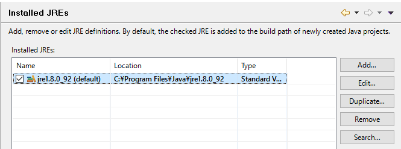
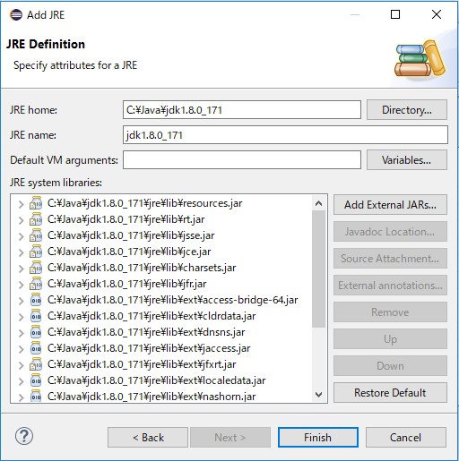
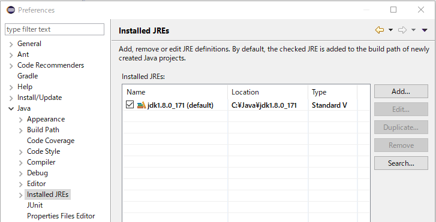
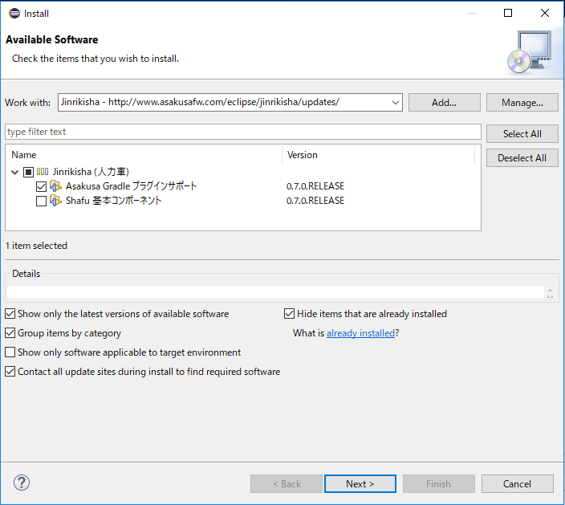
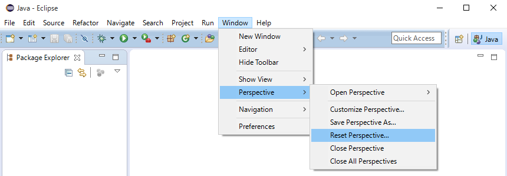
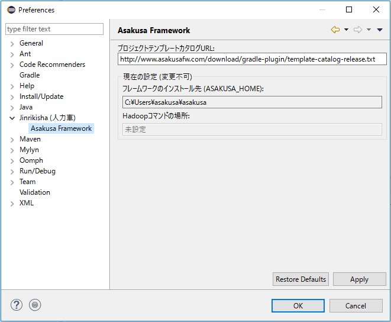

=========================
Eclipse環境のセットアップ
=========================

このチュートリアルでは、Asakusa Frameworkの開発で利用するEclipse環境のセットアップを行います。

..  note::
    :asakusafw:`[Asakusa Framework documentation] - Asakusa Frameworkスタートガイド <introduction/start-guide.html>`
    などの手順を実施済みなど、すでにEclipse環境が手元に整っている場合はこのチュートリアルの手順はスキップすることができます。

Eclipseの起動
=============

:doc:`development-environment` で用意した環境上でEclipseを起動します。

起動時には、必ず環境変数 ``ASAKUSA_HOME`` が適用された状態で起動してください。

Eclipseの設定
=============

Asakusa Frameworkの開発環境向けにEclipseの設定を行います。

以降の設定はEclipseの設定画面から行います。
Eclipseのメニューバーから :menuselection:`Window --> Preferences` で設定画面を表示します。

EclipseのJDK登録
----------------

Eclipse経由で実行するJavaにJREが設定されている場合、これをJDKに変更する必要があります。

1. Eclipseの設定画面から :menuselection:`Java --> Installed JREs` を選択します。
2. Installed JREs ダイアログにJREのJava定義が表示されている場合 (例えば以下のように ``jre8`` から始まる項目が表示されている場合)、以降の手順を実施してください。JDKが登録されている場合は以降の手順は不要です。

3. JREを削除します。 削除する項目を選択して、 :guilabel:`Remove` ボタンを押下します。
4. JDKを追加します。 :guilabel:`Add` ボタンを押下します。
5. JRE Type ダイアログで :guilabel:`Standard VM` を選択し :guilabel:`Next >` ボタンを押下します。
6. JRE Definition ダイアログで :guilabel:`JRE home:` の項目右の :guilabel:`Directory...` ボタンを押下し、JDKのフォルダを指定します。

7. JRE Definition ダイアログの各項目にインストールしたJDKの情報が設定されたことを確認して :guilabel:`Finish` ボタンを押下します。
8. Installed JREs ダイアログに追加したJDKの項目が表示されるので、その項目の :guilabel:`Name` 欄に表示されているチェックボックスを :guilabel:`ON` にします。
   JDKの項目が ``jdk1.8.0_XX (default)`` のような表示になれば設定完了です。

ネットワークプロキシの設定
--------------------------

オンラインとの接続にプロキシサーバを経由する必要がある場合は、Eclipseのプロキシ設定画面でプロキシの設定を行います。

1. Eclipseの設定画面から :menuselection:`General --> Network Connections` を選択します。
2. プロキシ設定画面で、 :guilabel:`Active Provider:` を ``Manual`` に変更し、 :guilabel:`Proxy entries` や :guilabel:`Proxy bypass` の内容を編集して :guilabel:`OK` ボタンを押します。

Shafuのインストール
===================

Asakusa Frameworkには開発支援ツールを提供する :jinrikisha:`Jinrikisha <index.html>` というサブプロジェクトがあります。
そこで公開しているツール :jinrikisha:`Shafu <shafu.html>` はAsakusa Frameworkのアプリケーション開発を支援するEclipseプラグインです。

Asakusa Frameworkではアプリケーションのビルドに `Gradle <http://www.gradle.org/>`_ というビルドシステムを利用しますが、
Shafuを使うことでGradleに関する詳細な知識がなくてもAsakusa Frameworkの基本的な開発作業が行えるようになります。
また、コマンドライン上でのGradleの操作が不要となり、Eclipse上でアプリケーション開発に必要なほとんどの作業を行うことができるようになります。

Shafuは一般的なEclipseプラグインと同様の手順でEclipseにインストールすることができます。

1. Eclipseのメニューバーから :menuselection:`Help --> Install New Software...` を選択します。
2. Install ダイアログで :guilabel:`Work with:` の項目右の :guilabel:`Add` ボタンを押下します。
3. Add Repository ダイアログに以下の値を入力します。

..  list-table::
    :widths: 2 5

    * - :guilabel:`Name:`
      - ``Jinrikisha``
    * - :guilabel:`Location:`
      - ``http://www.asakusafw.com/eclipse/jinrikisha/updates/``

4. Install ダイアログに表示された :guilabel:`Jinrikisha (人力車)` カテゴリを展開して :guilabel:`Asakusa Gradle プラグインサポート` を選択し、 :guilabel:`Next >` ボタンを押下します。

5. 以降、画面の指示に従いインストールを進めます。Eclipseの再起動を促されたら :guilabel:`Yes` を選択します。
6. Eclipseの再起動が完了したら :guilabel:`Java` パースペクティブを選択し、 メニューバーから :menuselection:`Window --> Perspective --> Reset Perspective..` を選択して :guilabel:`Java` パースペクティブを初期化します。

以降では、Eclipse上での作業は :guilabel:`Java` パースペクティブを使います。また、Eclipseの画面左側には :guilabel:`Package Explorer` を表示しているものとします。

Shafuの設定確認
===============

チュートリアルの環境向けにShafuの設定を確認します。

1. Eclipse設定画面から :guilabel:`Jinrikisha  (人力車)` を選択します。

2. :guilabel:`基本` タブの :guilabel:`Gradleのバージョンをラッパーの設定情報から取得` のチェックがONになっていることを確認します。

..  figure:: images/preference-jinrikisha-basic.png

..  note::
    上記の設定画面に :guilabel:`Gradleのバージョンをラッパーの設定情報から取得`  の項目がない場合は、インストールされているShafuのバージョンが古い可能性があります。
    この項目はShafuのバージョン 0.7.0 から追加されたため、これ以前のバージョンがインストールされている場合、通常のEclipse Pluginをアップデートする方法でShafuをアップデートしてください。

3. Eclipseの設定画面から :menuselection:`Jinrikisha (人力車) --> Asakusa Framework` を選択します。

4. :guilabel:`フレームワークのインストール先 (ASAKUSA_HOME)` の値に、環境変数 ``ASAKUSA_HOME`` の値が表示されていることを確認します。

   この値が空欄になっている場合、環境変数 ``ASAKUSA_HOME`` がEclipseの実行プロセスに反映されていないため、環境変数を正しく設定してEclipseを再起動してください。

関連ドキュメント
================

* :jinrikisha:`[Jinrikisha documentation] - Shafu - Asakusa Gradle Plug-in Helper for Eclipse - <shafu.html>`

