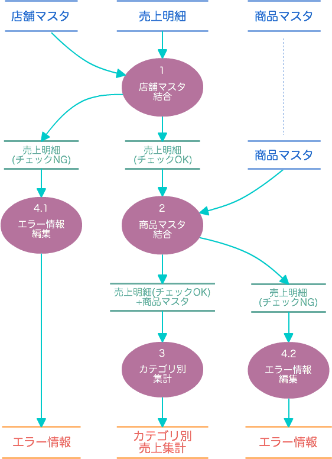

==============================
サンプルアプリケーションの説明
==============================

ここでは、このチュートリアルで作成するバッチアプリケーションの仕様や設計について説明します。
この内容を頭に入れておくことで、以降のチュートリアルの説明が理解しやすくなるでしょう。

アプリケーションの概要
======================

このチュートリアルで作成するバッチアプリケーションは「カテゴリー別売上金額集計バッチ」という名前のアプリケーションです。

カテゴリー別売上金額集計バッチを簡単に説明すると、売上トランザクションデータ、商品マスタ、店舗マスタを入力として、
トランザクションとマスタを結合しつつ各種エラーチェックを行った後に、売上データを商品マスタのカテゴリ毎に集計するアプリケーションです。

入出力データはCSV形式で定義されたファイルです。このバッチの実行結果は、集計結果を格納した「集計ファイル」、及びエラーチェックに該当した売上データを格納した「エラーレコードファイル」になります。

.. _example-app-dataflow:

データフロー図
==============

カテゴリー別売上金額集計バッチのデータフロー図を以下に示します。

図中の個々の要素については、この後に説明します。

.. _example-app-data-schema:

データ構造
==========

カテゴリー別売上金額集計バッチが扱う入出力データの論理的なデータ構造を示します。

.. _example-app-data-schema-sales_detail:

売上明細 ( ``sales_detail`` )
-----------------------------

このバッチの入力となるトランザクションデータで、このバッチのメイン処理である売上集計の元となる売上データが含まれます。

..  list-table:: 売上明細 ( ``sales_detail`` )
    :widths: 3 4 3
    :header-rows: 1

    * - 項目名
      - フィールド名
      - データ型
    * - 売上日時
      - ``sales_date_time``
      - 日時
    * - 店舗コード
      - ``store_code``
      - 文字列
    * - 商品コード
      - ``item_code``
      - 文字列
    * - 数量
      - ``amount``
      - 数値
    * - 販売単価
      - ``unit_selling_price``
      - 数値
    * - 販売金額
      - ``selling_price``
      - 数値

.. _example-app-data-schema-store_info:

店舗マスタ ( ``store_info`` )
-----------------------------

このバッチの入力となるマスタデータで、売上明細データの整合性チェックなどに使用します。

..  list-table:: 店舗マスタ ( ``store_info`` )
    :widths: 3 4 3
    :header-rows: 1

    * - 項目名
      - フィールド名
      - データ型
    * - 店舗コード
      - ``store_code``
      - 文字列
    * - 店舗名称
      - ``store_name``
      - 文字列

.. _example-app-data-schema-item_info:

商品マスタ ( ``item_info`` )
----------------------------

このバッチの入力となるマスタデータで、売上集計のグループキーとなる商品カテゴリコードを管理します。
その他、売上明細データの整合性チェックなどにも使用します。

..  list-table:: 商品マスタ ( ``item_info`` )
    :widths: 3 4 3
    :header-rows: 1

    * - 項目名
      - フィールド名
      - データ型
    * - 商品コード
      - ``item_code``
      - 文字列
    * - 商品名
      - ``item_name``
      - 文字列
    * - 商品部門コード
      - ``department_code``
      - 文字列
    * - 商品部門名
      - ``department_name``
      - 文字列
    * - 商品カテゴリコード
      - ``category_code``
      - 文字列
    * - 商品カテゴリ名
      - ``category_name``
      - 文字列
    * - 商品単価
      - ``unit_selling_price``
      - 数値
    * - マスタ登録日
      - ``registered_date``
      - 日付
    * - マスタ適用開始日
      - ``begin_date``
      - 日付
    * - マスタ適用終了日
      - ``end_date``
      - 日付

.. _example-app-data-schema-category_summary:

カテゴリ別売上集計 ( ``category_summary`` )
-------------------------------------------

このバッチの出力となる集計データで、売上明細に対して商品カテゴリ単位で数量と金額を集計した結果を保持します。

..  list-table:: カテゴリ別売上集計 ( ``category_summary`` )
    :widths: 3 4 3
    :header-rows: 1

    * - 項目名
      - フィールド名
      - データ型
    * - 商品カテゴリコード
      - ``category_code``
      - 文字列
    * - 販売数量
      - ``amount_total``
      - 数値
    * - 売上合計
      - ``selling_price_total``
      - 数値

.. _example-app-data-schema-error_record:

エラー情報 ( ``error_record`` )
-------------------------------

このバッチの出力となるエラー情報を保持するデータで、売上明細に対する整合性チェックにより集計に含めることができないと判断したレコード情報を保持します。

..  list-table:: エラー情報 ( ``error_record`` )
    :widths: 3 4 3
    :header-rows: 1

    * - 売上日時
      - フィールド名
      - データ型
    * - ファイル名
      - ``file_name``
      - 文字列
    * - 売上日時
      - ``sales_date_time``
      - 文字列
    * - 店舗コード
      - ``store_code``
      - 文字列
    * - 商品コード
      - ``item_code``
      - 文字列
    * - エラーメッセージ
      - ``message``
      - 文字列

外部入出力仕様
==============

カテゴリー別売上金額集計バッチの入出力データ形式や配置に関する仕様を示します。

.. _example-app-data-format:

データフォーマット
------------------

入出力データのフォーマットに関する仕様を示します。

* このバッチのすべての入出力データはCSVフォーマット形式を持つファイル(CSVファイル)として扱う。
* 各CSVファイルの文字エンコーディングはUTF-8として扱う。
* 各CSVファイルの1行目は各項目の内容を示すヘッダとして扱い、実データとしては扱わない。
* 各CSVファイルの日付項目のフォーマットは ``yyyy-MM-dd``、日時項目のフォーマットは ``yyyy-MM-dd HH:mm:ss`` とする。

.. _example-app-fileio-deployment:

ファイル配置と編成
------------------

入出力データの配置と編成に関する仕様を示します。
なお、ファイルの入出力には実行環境によって規定された「規定ディレクトリ」があるものとします。

売上明細
~~~~~~~~

* 規定ディレクトリ配下の ``sales`` ディレクトリ中にある、拡張子 ``*.csv`` を持つファイルを入力として扱う。
* バッチ起動時に指定される日付を表す文字列に従って入力するファイルを選択する。

..  code-block:: text

    日時,店舗コード,商品コード,数量,販売単価,販売金額
    2011-04-01 10:30:00,0001,4922010001000,3,120,360
    2011-04-01 10:31:00,0001,4922010001001,2,330,660
    2011-04-01 10:32:00,0001,4922010001000,2,120,240
    ...

店舗マスタ
~~~~~~~~~~

* 規定ディレクトリ配下の ``master`` ディレクトリ中にある、ファイル名 ``store_info.csv`` を持つファイルを入力として扱う。

..  code-block:: text

    店舗コード,名称
    0000,スーパーあさくさ本社
    0001,スーパーあさくさ品川店
    0002,スーパーあさくさ渋谷店
    ...

商品マスタ
~~~~~~~~~~

* 規定ディレクトリ配下の ``master`` ディレクトリ中にある、ファイル名 ``item_info.csv`` を持つファイルを入力として扱う。

..  code-block:: text

    商品コード,商品名,部門コード,部門名,カテゴリコード,カテゴリ名,単価,登録日,適用開始日,適用終了日
    4922010001000,ミルクチョコレートM,110,菓子,1600,チョコレート菓子,120,2010-04-01,2010-04-01,2019-12-31
    4922010001001,PREMIUM アソートチョコレート,110,菓子,1600,チョコレート菓子,330,2010-04-01,2010-04-01,2019-12-31
    4922010001002,アーモンドクランチミニ,110,菓子,1600,チョコレート菓子,140,2010-04-01,2010-04-01,2019-12-31
    ...

カテゴリ別売上集計
~~~~~~~~~~~~~~~~~~

* 規定ディレクトリ配下の ``result/category`` ディレクトリに対して、ファイル名 ``result.csv`` を持つファイルを処理結果として出力する。
* ファイル中の項目「売上合計」の降順でソートして出力する。

..  code-block:: text

    カテゴリコード,販売数量,売上合計
    1600,28,5400
    1300,12,1596
    1401,15,1470

エラー情報
~~~~~~~~~~

* 規定ディレクトリ配下の ``result/error`` ディレクトリに対して、バッチ起動時に指定された日付文字列を接頭辞に持つファイル (例: ``2011-04-01.csv`` )を処理結果として出力する。
* ファイル中の項目「ファイル名」の昇順でソートして出力する。

..  code-block:: text

    ファイル名,日時,店舗コード,商品コード,メッセージ
    hdfs://<host:port>/user/asakusa/target/testing/directio/sales/2011-04-01.csv,2011-04-01 19:00:00,9999,4922010001000,店舗不明
    hdfs://<host:port>/user/asakusa/target/testing/directio/sales/2011-04-01.csv,2011-04-01 10:00:00,0001,9999999999999,商品不明
    hdfs://<host:port>/user/asakusa/target/testing/directio/sales/2011-04-01.csv,1990-01-01 10:40:00,0001,4922010001000,商品不明

バッチ処理仕様
==============

カテゴリー別売上金額集計バッチの `データフロー図`_ に対応する各処理の仕様を示します。

.. _example-app-process-join-store:

1.店舗マスタ結合
----------------

* 売上明細に対して、店舗マスタを「店舗コード」をキーとして結合し、マスタが存在した売上明細を集計の対象とする。
* 該当する店舗マスタが存在しなかった売上明細は、後述の `4.エラー情報編集`_ に従いエラー情報として出力する。

.. _example-app-process-join-item:

2.商品マスタ結合
----------------

* `1.店舗マスタ結合`_ 済みの売上明細に対して、商品マスタを「商品コード」をキーとして結合し、マスタが存在した売上明細を集計の対象とする。
* 結合時に、売上明細の「売上日時」が、商品マスタの「マスタ適用開始日」と「マスタ適用終了日」の範囲内にあるレコードを選択する。
* 該当する商品マスタが存在しなかった売上明細は、後述の `4.エラー情報編集`_ に従い エラー情報として出力する。

.. _example-app-process-summarize:

3.カテゴリ別集計
----------------

* 商品マスタと結合済みの売上明細に対して、「カテゴリコード」をグループ単位のキーとして集計を行う。
* 集計する項目は売上明細の「数量」および「販売金額」の２項目で、グループ単位でこれらの数値の合計値を算出する。
* 集計結果は「カテゴリ別売上集計」として `外部入出力仕様`_ に従い出力する。

.. _example-app-process-errorinfo:

4.エラー情報編集
----------------

* `1.店舗マスタ結合`_ でマスタが存在しなかった売上明細は、エラーメッセージ「 ``店舗不明`` 」を含むエラー情報として `外部入出力仕様`_ に従い出力する。
* `2.商品マスタ結合`_ でマスタが存在しなかった売上明細は、エラーメッセージ「 ``商品不明`` 」を含むエラー情報として `外部入出力仕様`_ に従い出力する。
