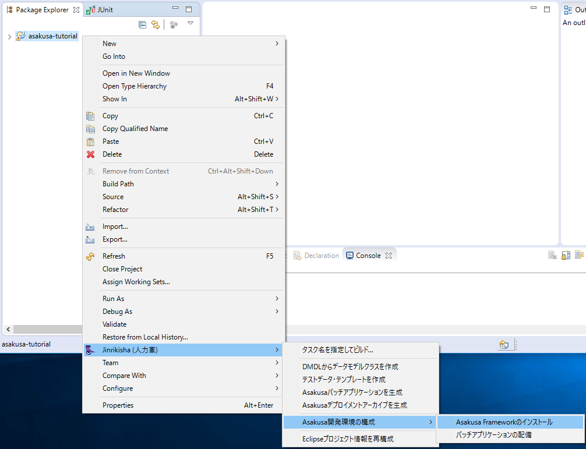
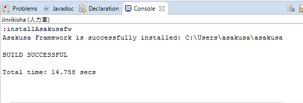

===============================
Asakusa Frameworkのインストール
===============================

このチュートリアルでは、開発環境に対してAsakusa Frameworkのインストールを行います。

開発環境にAsakusa Frameworkをインストールする
=============================================

:doc:`create-project` でプロジェクトを準備したら、次に開発環境にAsakusa Frameworkの実行環境をインストールします。
この実行環境は、アプリケーションのテスト実行時などに使用します。

:doc:`create-project` で作成したプロジェクトには、Asakusa Frameworkのインストールやデプロイに関する構成情報が含まれています。
このため、Asakusa Frameworkのインストールやデプロイ用のパッケージ生成はプロジェクトに対して実行します。

Eclipseからインストール
-----------------------

Shafuを導入したEclipse環境では、EclipseのコンテキストメニューからAsakusa Frameworkのインストールを実行することができます。

1. Javaパースペクティブ上でプロジェクト ``asakusa-tutorial`` を選択してコンテキストメニュー(右クリックなどで表示されるメニュー)を表示し、
   コンテキストメニューから :menuselection:`Jinrikisha (人力車) --> Asakusa開発環境の構成 --> Asakusa Frameworkのインストール` を選択します。

2. Consoleビュー [#]_ に処理の経過が出力されます。正常に終了すると、以下のように ``BUILD SUCCESSFUL`` [#]_ と出力されます。

..  [#] 以降のチュートリアルでは、Consoleビューへの出力は単に「コンソール」と表記し、その出力内容のみを記述します。
..  [#] Shafuの他のメニューを実行する場合も同様です。以降のチュートリアルではメニューを実行した際に、このメッセージを確認してください。

コマンドラインからインストール
------------------------------

コマンドライン上からインストールする場合、Gradleの :program:`installAsakusafw` タスクを実行します。

プロジェクト上でタスクを実行するには、ターミナル上でプロジェクトのディレクトリに移動して、
以下のように :program:`gradlew` コマンド (Windows環境の場合は :program:`gradlew.bat` コマンド) にタスク名を指定して実行します。

..  code-block:: sh
    :caption: Unix系OS(LinuxやMacOSXなど)環境での実行例

    ./gradlew installAsakusafw

..  code-block:: sh
    :caption: Windows環境での実行例

    gradlew.bat installAsakusafw

正常に終了すると、以下のように ``BUILD SUCCESSFUL`` と出力されます。

..  code-block:: none

    :installAsakusafw
    Asakusa Framework is successfully installed: C:\Users\asakusa\asakusa

    BUILD SUCCESSFUL

    Total time: 12.358 secs

..  note::
    以降のチュートリアルでは、Gradleを使ったコマンドラインの実行例はUnix系OSの例のみを記載します。
    Windowsを利用している場合は、チュートリアルの説明を適宜読みかえて進めてください。

トラブルシューティング
======================

このチュートリアルに関するトラブルシューティングです。

Asakusa Frameworkのインストールに失敗する
-----------------------------------------

`開発環境にAsakusa Frameworkをインストールする`_ の手順を実行すると、以下のエラーメッセージが表示されインストールに失敗する。

..  code-block:: none

    ...
    :updateAsakusafw FAILED

    FAILURE: Build failed with an exception.

    * What went wrong:
    Execution failed for task ':updateAsakusafw'.
    > ASAKUSA_HOME is not defined
    ...

想定される原因
~~~~~~~~~~~~~~

環境変数 ``ASAKUSA_HOME`` が設定されていない可能性があります。
環境変数の設定については、:doc:`development-environment` を参照してください。

Eclipseを起動中に環境変数を追加した場合は、Eclipseの再起動が必要です。
