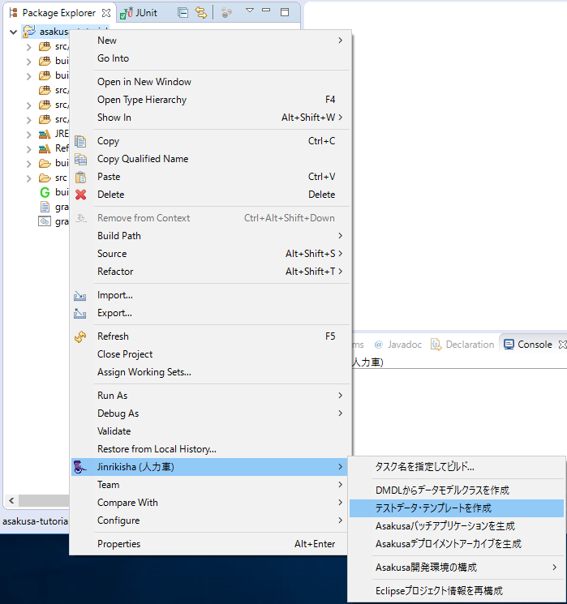
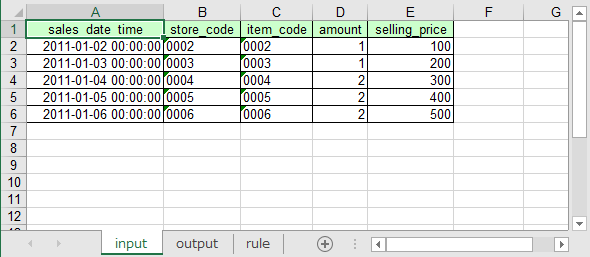
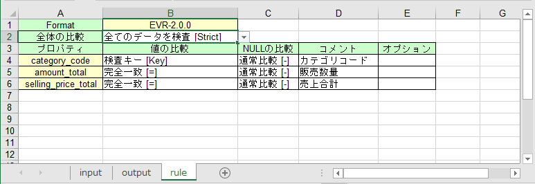
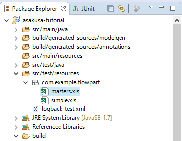
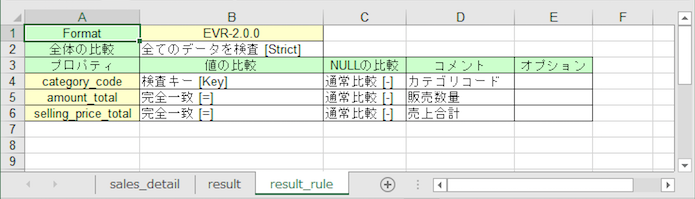
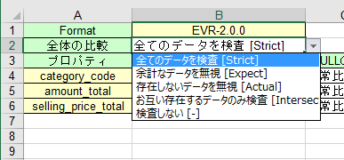
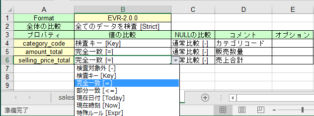

==================
フロー部品のテスト
==================

このチュートリアルでは、フロー部品をはじめとするデータフローのテストを作成する方法を説明していきます。

データフローのテスト
====================

Flow DSLで記述したフロー部品やジョブフローなどのクラスは、通常のJavaクラスとしてはテストすることができません。
Flow DSLは単体では動作せず、実行可能なバッチアプリケーションを生成した上でテストを行う必要があるためです。

また、データフローに対するテストデータを実行プログラムが規定する方法で配置する必要があるため、そのままでは自動テストを行うことが困難です。

このためAsakusa Frameworkはテストの実行に必要な一連の処理を自動的に行う **テストドライバー** というモジュールを提供しています。

テストドライバーはテスト対象の要素に対して、次の一連の処理を行います。

#. 入力データを初期化する
#. 入力データを流し込む
#. 対象のプログラムをコンパイルして実行可能なバッチアプリケーションを生成する
#. バッチアプリケーションを実行する
#. 出力結果を取り込む
#. 出力結果と期待データを検証する

なおテストドライバーの実行には、テスト実行環境に対して :doc:`install-asakusafw` が必要です。

テストデータの準備
==================

テストドライバーでのテストを行うには、次の3種類の情報を用意します。

入力データ
  それぞれのデータフローの入力に指定するデータセット。

期待データ
  それぞれのデータフローからの出力に期待するデータセット。

出力の検証方法
  それぞれの出力と期待データを比較して間違いを見つける方法。

ここでは、これらをまとめて **テストデータ** と呼ぶことにします。

テストデータはExcel形式, JSON形式, Javaプログラムなど様々な方法で定義することができますが、
ここでは理解しやすいExcel形式でテストデータを作成していきます。

Excelが用意できない環境では、このチュートリアルの `終わりに`_ からテストデータを作成済みのExcelファイルをダウンロードできるのでそれを利用してください。
なおテストの実行はExcelがインストールされていないマシン上でも行うことができます。

テストデータテンプレートを生成する
==================================

Excel形式でテストデータを作成する場合、DMDLスクリプトで記述したデータモデルの定義からテストデータ用のExcelファイルのテンプレートを自動生成して利用することができます。

ここではテストデータテンプレートに対してテストデータを定義していきます。

Eclipse上でテストデータテンプレートを生成
-----------------------------------------

Shafuを導入したEclipse環境では、コンテキストメニューから :menuselection:`Jinrikisha (人力車) --> テストデータ・テンプレートを生成` を選択します。

コマンドライン上でテストデータテンプレートを生成
------------------------------------------------

コマンドライン上からテストデータテンプレートを生成する場合は、Gradleの :program:`generateTestbook` タスクを実行します。

..  code-block:: sh

    ./gradlew generateTestbook

テストデータテンプレート
------------------------

テストデータテンプレートを生成するとプロジェクトのビルドフォルダ :file:`build/excel` 以下に、データモデルごとにExcelファイルが生成されます。

このチュートリアルではDMDLスクリプト :file:`src/main/dmdl/models.dmdl` のデータモデル定義に基づいて、以下のファイルが作られます。

* ``sales_detail.xls``
* ``store_info.xls``
* ``item_info.xls``
* ``category_summary.xls``
* ``error_record.xls``
* ``joined_sales_info.xls``

これらのExeclブックには以下の3種類のシートが含まれています。

入力データシート
  入力データを定義するシート。
  初期状態では ``input`` というシート名で作成されています。

  入力データシートはレコードを各行で表し、各列にヘッダに指定したプロパティ値を定義します。
  テンプレートの初期状態は空データ（ヘッダのみが記述されている）の状態です。

    [入力データシートの定義例]

期待データシート
  出力データに対する期待値を定義するシート。
  初期状態では ``output`` というシート名で作成されています。
  入力データシートと同じ形式を持ちます。

比較条件シート
  出力結果データと期待データの比較条件を定義するシート。
  初期状態では ``rule`` というシート名で作成されています。

  全体的な比較の方針や、それぞれのプロパティをどのように比較するかをドロップダウン形式で選択します。

    [比較条件シートの定義例]

テストデータの構成を定義する
============================

テストデータテンプレートからテストデータを作成する際には、ファイル名やファイルに含めるシートの構造は任意に変更することができます。
たとえば複数のデータモデルを表す入力データシートを1つのファイルにまとめたり、テストケースごとに各データモデルのテストデータを1ファイルにまとめる、といった使い方が可能です。

このチュートリアルでは、以下の2種類の構成でテストデータを作成することにします。

* `共通マスタ`_
* `テストケース`_

共通マスタ
----------

すべてのテストケースで利用する共通のマスタデータを定義します。
このテストデータには以下のシートを含めます。

   * ``store_info`` : 店舗マスタの入力データシート。テストデータテンプレートファイル ``store_info.xls`` の ``input`` シートをベースとする。
   * ``item_info`` : 商品マスタの入力データシート。テストデータテンプレートファイル ``item_info.xls`` の ``input`` シートをベースとする。

ここでは共通マスタのテストデータを ``masters.xls`` というファイルで作成します。
このシート構成を作成する手順の例を以下に示します。

1. テストデータテンプレートファイル ``store_info.xls`` をコピーして ``masters.xls`` を作成する。
2. ``masters.xls`` を開き、 シート名 ``input`` を ``store_info`` に変更する。また ``output`` シートと ``rule`` シートは削除する。
3. ``masters.xls`` を開いているExcel上から ``item_info.xls`` を開き、シート名 ``input`` を ``item_info`` に変更する。
4. ``item_info`` シートに対してコンテキストメニューから「移動またはコピー」を選択し ``masters.xls`` の末尾にコピーする。

テストケース
------------

各テストケースごとに、入力データとなる売上明細、期待値となるカテゴリ別売上集計、検証ルールの3つの組み合わせをもつテストデータを定義します。
このテストデータには以下のシートを含めます。

   * ``sales_detail`` : 売上明細の入力データシート。テストデータテンプレートファイル ``sales_detail.xls`` の ``input`` シートをベースとする
   * ``result`` : カテゴリ別売上集計の期待データシート。テストデータテンプレートファイル ``category_summary.xls`` の ``output`` シートをベースとする
   * ``result_rule`` : カテゴリ別売上集計の比較条件シート。テストデータテンプレートファイル ``category_summary.xls`` の ``rule`` シートをベースとする

ここでは最も単純なテストケースに対応するテストデータを ``simple.xls`` として作成します。
`共通マスタ`_ の例を参考にして ``simple.xls`` にシート構成を作成してください。

テストデータの配置
------------------

テストドライバからテストデータを利用するにはプロジェクトのソースフォルダ ``src/test/resources`` 配下に、
テストデータを利用するテストクラスと同じパッケージかそのサブパッケージ上に配置します。

ここでは ``src/test/resources`` 配下にテストクラスと同じパッケージに対応するディレクトリ ``com/example/flowpart`` を作成し、
ここに `テストデータの構成を定義する`_ で作成したテストデータ ``masters.xls`` と ``simple.xls`` を配置します。

入力データを定義する
====================

配置したテストデータ ``masters.xls`` と ``simple.xls`` に対して入力データを定義していきます。

store_infoシート
----------------

まずは、 ``masters.xls`` のシート ``store_info`` に以下の店舗マスタのデータを定義します。

..  csv-table:: ``masters.xls`` - ``store_info``
    :header: store_code,store_name

    0001,DUMMY
    0002,DUMMY
    0003,DUMMY
    0004,DUMMY
    0005,DUMMY
    0006,DUMMY
    0007,DUMMY
    0008,DUMMY
    0009,DUMMY
    0010,DUMMY

文字列型のプロパティに対応するテストデータを入力する際には注意が必要です。

例えば上記のプロパティ ``store_code`` は文字列として定義する必要があるのですが、
Excelでは ``0001`` のように文字列をセルに入力した場合に、入力値に応じて数値や日付などの別の形式に変換されてしまう場合があります。
この場合 ``0001`` は固定長の0埋め文字列として扱いたいのですが、数値の ``1`` として扱われてしまう恐れがあります。

テストドライバではこのようなテスト時のミスを減らすため、文字列型のプロパティに対してExcel上で文字列型以外の値が入力されている場合、
テストが失敗するようになっています。

Excelのセルに対して入力値を強制的に文字列として扱うには、入力値の先頭に ``'`` (シングルクウォート) を付与します。
このシングルクウォート記号は文字列に含まれず、以降の値が文字列として取り扱われます。

また、空のセルはテストドライバーでは ``NULL`` 値として取り扱われます。
長さ0の文字列を入力したい場合には ``'`` のみを指定してください。

item_infoシート
---------------

続けて ``masters.xls`` のシート ``item_info`` に以下の商品マスタのデータを定義します。

..  csv-table:: ``masters.xls`` - ``item_info``
    :header: item_code,item_name,category_code,begin_date,end_date

    0001,dummy,test1,1970/01/01,2031/01/01
    0002,dummy,test2,1970/01/01,2031/01/01
    0003,dummy,test1,1970/01/01,2031/01/01
    0004,dummy,test2,1970/01/01,2031/01/01
    0005,dummy,test1,1970/01/01,2031/01/01
    0006,dummy,test2,1970/01/01,2031/01/01
    0007,dummy,test1,1970/01/01,2031/01/01
    0008,dummy,test2,1970/01/01,2031/01/01
    0009,dummy,test1,1970/01/01,2031/01/01
    0010,dummy,test2,1970/01/01,2031/01/01
    1001,dummy,test3,2011/01/01,2011/02/01
    1001,dummy,test3,2011/02/01,2011/03/01
    1001,dummy,test3,2011/03/01,2011/04/01
    1001,dummy,test3,2011/04/01,2011/05/01
    1001,dummy,test3,2011/05/01,2011/06/01
    1001,dummy,test3,2011/06/01,2011/07/01
    1001,dummy,test3,2011/07/01,2011/08/01
    1001,dummy,test3,2011/08/01,2011/09/01
    1001,dummy,test3,2011/09/01,2011/10/01
    1001,dummy,test3,2011/10/01,2011/11/01

テストデータテンプレートの初期状態ではデータモデルがもつすべてのプロパティがヘッダとして定義されていますが、
テストの入力時に不要なプロパティがある場合、その列は削除してしまってかまいません。
削除した場合、すべてのレコードでそのプロパティは ``NULL`` として取り扱います。

ここでは上記に記載しているプロパティのみを入力し、その他のプロパティ列は削除してください。

sales_detailシート
------------------

最後に ``simple.xls`` のシート ``sales_detail`` に以下の売上明細のデータを定義します。

ここでは最も単純なテストケースとして定義するため、以下の1レコードのみを定義します。

..  csv-table:: ``simple.xls`` - ``item_info``
    :header: sales_date_time,store_code,item_code,amount,selling_price

    2011-01-01 00:00:00,0001,0001,1,100

``item_info`` の場合と同様、上記に記載しているプロパティのみを入力し、その他のプロパティ列は削除してください。

期待値を定義する
================

続けて ``simple.xls`` に対して期待値データを定義します。

resultシート
------------

ここでは ``simple.xls`` の期待データシート ``result`` に期待値を記述していきます。
記述方法は `入力データを定義する`_ と同様です。

ここでも、最も単純なテストケースとして定義するため、1レコードのみを定義します。

..  csv-table:: ``simple.xls`` - ``result``
    :header: category_code,amount_total,selling_price_total

    test1,1,100

出力の検証方法を定義する
========================

最後に ``simple.xls`` に対して比較検証ルールを定義します。

result_ruleシート
-----------------

ここでは ``simple.xls`` の比較条件シート ``result_rule`` に検証ルールを設定していきます。
比較条件シートは、検証ルールの各項目をドロップダウン形式で選択することで設定していきます。

全体の比較
~~~~~~~~~~

まず2行目の **全体の比較** を指定します。

ここではテストの実行結果として、期待値のみ存在するレコードや実際のテスト実行結果のみ存在するレコードがあった場合の動作を決定します。

ここでは ``すべてのデータを検査`` を指定します。
このルールは期待値のみ存在するレコードがあった場合、および実際のテスト実行結果のみ存在するレコードがあった場合のどちらも比較失敗として扱います。

``検査しない`` を選択した場合、レコードを一切比較しません。これはデータフロー実行の疎通確認を行いたい場合や、一時的に比較を行わない場合などに利用します。

値の比較
~~~~~~~~

4行以降では、データモデルの各プロパティに対する **値の比較** を指定します。

ここではテストの実行結果に対して、各データモデルをプロパティ単位でどのように比較するかを指定します。

まず4行目の ``category_code`` には ``検査キー`` を指定します。

検査キーは、期待データシートに定義した期待値と実際のテスト実行結果のレコードの突き合せに、データモデルのどのプロパティを使うかを指定します。

検査キーを指定したプロパティは **キープロパティ** と呼びます。キープロパティは複合キーとして、複数のプロパティを指定することもできます。

5行目の ``amount_total`` , および6行目の ``selling_price_total`` には ``完全一致`` を指定します。
完全一致は、プロパティの値が完全に同じ場合のみ比較成功とみなします。

フロー部品のテストクラスを作成する
==================================

テストデータを作成したら、これを使ってテストを実行するテストクラスを作成します。
フロー部品のテストも演算子と同様にJUnitを使ったテストクラスとして実装します。

テストクラスは演算子の場合と同様に、プロジェクトのソースフォルダ ``src/test/java`` 配下に任意のJavaパッケージ名とクラス名を持つクラスとして作成できます。
テスト対象のフロー部品クラスをベースにしたクラス名を指定すると便利でしょう。

ここでは、 :doc:`dsl-flowpart-1` で作成したフロー部品クラス ``CategorySummaryFlowPart`` に対するテストクラスを以下のように作成します。

..  list-table::
    :widths: 2 5

    * - パッケージ名
      - ``com.example.flowpart``
    * - クラス名
      - ``CategorySummaryFlowPartTest``

..  code-block:: java
    :caption: CategorySummaryFlowPartTest.java
    :name: CategorySummaryFlowPartTest.java-1

    package com.example.flowpart;

    public class CategorySummaryFlowPartTest {

    }

フロー部品のテストメソッドを作成する
====================================

各テストケースに対応するテストメソッドを作成していきます。
このチュートリアルで作成するテストクラスでは以下の構成でテストメソッドを作成します。

* `テストケース`_ で作成するテストデータの単位でテストメソッドを作成する
* テストメソッドでは使用するテストデータを指定するのみで、テスト実装は共通のプライベートメソッド ``run`` に記述する。

まず、テストケースに対応するテストメソッドを作成します。
このメソッドは ``run`` メソッドを呼ぶだけで、テストデータのExcelファイル名を渡すようにしました。

..  code-block:: java
    :caption: CategorySummaryFlowPartTest.java
    :name: CategorySummaryFlowPartTest.java-2

    @Test
    public void simple() {
        run("simple.xls");
    }

次にテスト実装の本体であるプライベートメソッド ``run`` を実装します。

..  code-block:: java
    :caption: CategorySummaryFlowPartTest.java
    :name: CategorySummaryFlowPartTest.java-3

    private void run(String dataSet) {

    }

フロー部品をテストするには、まずテストドライバ用のAPIクラス ``FlowPartTester`` [#]_ をインスタンス化します。

..  code-block:: java
    :caption: CategorySummaryFlowPartTest.java
    :name: CategorySummaryFlowPartTest.java-4
    :emphasize-lines: 6

    ...
    import com.asakusafw.testdriver.FlowPartTester;
    ...

    private void run(String dataSet) {
        FlowPartTester tester = new FlowPartTester(getClass());

    }

``FlowPartTester`` をインスタンス化する際には、引数に ``getClass()`` を呼んでテストケース自身のクラスを引き渡します。
このクラス情報は配置したテストデータを検索するなどに利用します。

次に、このテストケースの入力データをデータモデルごとに指定します。
ここでは `入力データを定義する`_ で定義した `store_infoシート`_ , `item_infoシート`_ , `sales_detailシート`_ の3つの入力データシートを指定します。

まず `store_infoシート`_ を指定します。

..  code-block:: java
    :caption: CategorySummaryFlowPartTest.java
    :name: CategorySummaryFlowPartTest.java-5
    :emphasize-lines: 9-10

    ...
    import com.asakusafw.vocabulary.flow.In;
    import com.example.modelgen.dmdl.model.StoreInfo;
    ...

    private void run(String dataSet) {
        FlowPartTester tester = new FlowPartTester(getClass());

        In<StoreInfo> storeInfo = tester.input("storeInfo", StoreInfo.class)
            .prepare("masters.xls#store_info");

    }

テストで使用する入力データを指定するには、 ``FlowPartTester`` が持つ ``input`` メソッドを利用します。
この引数には第1引数に入力の名前、第2引数に入力のデータモデル型を指定します。
第1引数の名前は他の名前と重複せず、アルファベットや数字のみで構成して下さい

``input`` に続けて、 ``prepare`` で入力データシートを指定します。
引数には `テストデータの配置`_ で配置したテストデータを ``<Excelのファイル名>#<シート名>`` という形式で指定します。

``prepare`` メソッドの戻り値は、 ``In<データモデル型>`` [#]_ の変数に保持します。
この入力オブジェクトはフロー部品の実行時に指定します。

同様にして `item_infoシート`_ , `sales_detailシート`_ を指定します。
`sales_detailシート`_ はテストケースごとに異なる値を使用するため、引数で受け取ったファイル名を指定します。

..  code-block:: java
    :caption: CategorySummaryFlowPartTest.java
    :name: CategorySummaryFlowPartTest.java-6
    :emphasize-lines: 6-9

    private void run(String dataSet) {
        FlowPartTester tester = new FlowPartTester(getClass());

        In<StoreInfo> storeInfo = tester.input("storeInfo", StoreInfo.class)
            .prepare("masters.xls#store_info");
        In<ItemInfo> itemInfo = tester.input("itemInfo", ItemInfo.class)
            .prepare("masters.xls#item_info");
        In<SalesDetail> salesDetail = tester.input("salesDetail", SalesDetail.class)
            .prepare(dataSet + "#sales_detail");

    }

続けてこのテストケースの出力に対する期待値データと検証ルールをデータモデルごとに指定します。
ここでは `期待値を定義する`_ で定義した `resultシート`_ 、 `出力の検証方法を定義する`_ で定義した `result_ruleシート`_ を指定します。

..  code-block:: java
    :caption: CategorySummaryFlowPartTest.java
    :name: CategorySummaryFlowPartTest.java-7
    :emphasize-lines: 11-12

    private void run(String dataSet) {
        FlowPartTester tester = new FlowPartTester(getClass());

        In<StoreInfo> storeInfo = tester.input("storeInfo", StoreInfo.class)
            .prepare("masters.xls#store_info");
        In<ItemInfo> itemInfo = tester.input("itemInfo", ItemInfo.class)
            .prepare("masters.xls#item_info");
        In<SalesDetail> salesDetail = tester.input("salesDetail", SalesDetail.class)
            .prepare(dataSet + "#sales_detail");

        Out<CategorySummary> categorySummary = tester.output("categorySummary", CategorySummary.class)
            .verify(dataSet + "#result", dataSet + "#result_rule");

    }

テストの出力に関するテストデータを定義するには、 ``FlowPartTester`` が持つ ``output`` メソッドを利用します。
引数の構成は ``input`` と同様です。

``output`` に続けて、 ``verify`` で第1引数に期待値データ、第2引数で検証ルールをそれぞれ指定します。
引数の形式は ``prepare`` と同様です。
出力の定義結果は、 ``Out<データモデル型>`` [#]_ の変数に保存します。

エラー情報 ``ErrorRecord`` については検証を行わないので ``verify`` を呼ばす、
代わりに出力データをExcelファイルに出力するための ``dumpActual`` メソッドを利用します。
``dumpActual`` は引数で指定したパスに実行結果を出力します。

..  code-block:: java
    :caption: CategorySummaryFlowPartTest.java
    :name: CategorySummaryFlowPartTest.java-8
    :emphasize-lines: 13-14

    private void run(String dataSet) {
        FlowPartTester tester = new FlowPartTester(getClass());

        In<StoreInfo> storeInfo = tester.input("storeInfo", StoreInfo.class)
            .prepare("masters.xls#store_info");
        In<ItemInfo> itemInfo = tester.input("itemInfo", ItemInfo.class)
            .prepare("masters.xls#item_info");
        In<SalesDetail> salesDetail = tester.input("salesDetail", SalesDetail.class)
            .prepare(dataSet + "#sales_detail");

        Out<CategorySummary> categorySummary = tester.output("categorySummary", CategorySummary.class)
            .verify(dataSet + "#result", dataSet + "#result_rule");
        Out<ErrorRecord> errorRecord = tester.output("errorRecord", ErrorRecord.class)
                .dumpActual("build/dump/error_" + dataSet);

    }

テストデータの定義が終わったら、入力オブジェクトと出力オブジェクトを指定してフロー部品クラスをインスタンス化します。

..  code-block:: java
    :caption: CategorySummaryFlowPartTest.java
    :name: CategorySummaryFlowPartTest.java-9
    :emphasize-lines: 16-17

    private void run(String dataSet) {
        FlowPartTester tester = new FlowPartTester(getClass());

        In<StoreInfo> storeInfo = tester.input("storeInfo", StoreInfo.class)
            .prepare("masters.xls#store_info");
        In<ItemInfo> itemInfo = tester.input("itemInfo", ItemInfo.class)
            .prepare("masters.xls#item_info");
        In<SalesDetail> salesDetail = tester.input("salesDetail", SalesDetail.class)
            .prepare(dataSet + "#sales_detail");

        Out<CategorySummary> categorySummary = tester.output("categorySummary", CategorySummary.class)
            .verify(dataSet + "#result", dataSet + "#result_rule");
        Out<ErrorRecord> errorRecord = tester.output("errorRecord", ErrorRecord.class)
                .dumpActual("build/dump/error_" + dataSet);

        FlowDescription flowPart = new CategorySummaryFlowPart(
            salesDetail, storeInfo, itemInfo, categorySummary, errorRecord);

      }

このインスタンスを引数にして ``FlowPartTester`` が持つ ``runTest`` メソッドを実行すると、テストデータに応じたテストを自動的に実行します。

..  code-block:: java
    :caption: CategorySummaryFlowPartTest.java
    :name: CategorySummaryFlowPartTest.java-10
    :emphasize-lines: 18

    private void run(String dataSet) {
        FlowPartTester tester = new FlowPartTester(getClass());

        In<StoreInfo> storeInfo = tester.input("storeInfo", StoreInfo.class)
            .prepare("masters.xls#store_info");
        In<ItemInfo> itemInfo = tester.input("itemInfo", ItemInfo.class)
            .prepare("masters.xls#item_info");
        In<SalesDetail> salesDetail = tester.input("salesDetail", SalesDetail.class)
            .prepare(dataSet + "#sales_detail");

        Out<CategorySummary> categorySummary = tester.output("categorySummary", CategorySummary.class)
            .verify(dataSet + "#result", dataSet + "#result_rule");
        Out<ErrorRecord> errorRecord = tester.output("errorRecord", ErrorRecord.class)
                .dumpActual("build/dump/error_" + dataSet);

        FlowDescription flowPart = new CategorySummaryFlowPart(
            salesDetail, storeInfo, itemInfo, categorySummary, errorRecord);
        tester.runTest(flowPart);
    }

..  [#] :javadoc:`com.asakusafw.testdriver.FlowPartTester`
..  [#] ここの名前は他の名前と重複せず、アルファベットや数字のみで構成して下さい
..  [#] :javadoc:`com.asakusafw.vocabulary.flow.In`
..  [#] :javadoc:`com.asakusafw.vocabulary.flow.Out`

テストを実行する
================

テストクラスを作成したら、テストを実行してみましょう。

テストクラスは通常のJUnitのテストを実行する方法と同じです。
JUnitのテストを実行する手順は、 :doc:`testing-operator` - :ref:`testing-operator-run-tests` などを参考にしてください。

テストケースを追加する
======================

ここまでの手順でもっとも単純なテストケースが確認できたので、同様の手順でテストケースを追加していきましょう。

想定されるテストケースの例を以下に示します。

* カテゴリ別の集計が正しく行われることを確認する
* マスタ有効期限に基づく正しいマスタが選択される
* 正しくない店舗情報を含む場合にエラー情報が出力される

すべてのテストケースに対応するテストデータとテストクラスの例は、このチュートリアルの最後に記載します。

終わりに
========

このチュートリアル終了時点のフロー部品テストクラス :file:`CategorySummaryFlowPartTest.java` は、次のようになります。

..  literalinclude:: dsl-attachment/CategorySummaryFlowPartTest.java
    :language: java
    :linenos:
    :caption: CategorySummaryFlowPartTest.java
    :name: CategorySummaryFlowPartTest.java-all

また、テストクラスに対応するテストデータのExcelは以下からダウンロードできます。

* :download:`masters.xls <dsl-attachment/excel/masters.xls>`
* :download:`simple.xls <dsl-attachment/excel/simple.xls>`
* :download:`summarize.xls <dsl-attachment/excel/summarize.xls>`
* :download:`available_range.xls <dsl-attachment/excel/available_range.xls>`
* :download:`invalid_store.xls <dsl-attachment/excel/invalid_store.xls>`

トラブルシューティング
======================

このチュートリアルに関するトラブルシューティングです。

Asakusa Framework is not installed
----------------------------------

`テストを実行する`_ の手順を実行すると、以下のエラーメッセージが表示されテストが失敗する。

..  code-block:: none

    ...
    java.lang.IllegalStateException: java.io.IOException: Asakusa Framework is not installed: C:\Users\asakusa\asakusa
      at com.asakusafw.testdriver.JobFlowTester.runTest(JobFlowTester.java:105)
    ...

想定される原因
~~~~~~~~~~~~~~

開発環境 ``ASAKUSA_HOME`` にAsakusa Frameworkがインストールされていない可能性があります。
:doc:`install-asakusafw` の手順が正しく行われているかを確認してください。

Failed to locate the winutils
-----------------------------

Windows環境で `テストを実行する`_ の手順を実行すると、以下のエラーメッセージが表示される。テスト自体は成功する。

..  code-block:: none

    ...
    ERROR Failed to locate the winutils binary in the hadoop binary path
    java.io.IOException: Could not locate executable null\bin\winutils.exe in the Hadoop binaries.
    ...

想定される原因
~~~~~~~~~~~~~~

現時点でのAsakusa Frameworkの制限事項で、Windows上でテストドライバを実行するとこのメッセージが出力されることがあります。
テスト自体の動作には影響ありません。

関連ドキュメント
================

* :asakusafw:`[Asakusa Framework documentation] - アプリケーションテストスタートガイド <testing/start-guide.html>`
* :asakusafw:`[Asakusa Framework documentation] - テストドライバーユーザーガイド <testing/user-guide.html>`
* :asakusafw:`[Asakusa Framework documentation] - Excelによるテストデータ定義 <testing/using-excel.html>`

