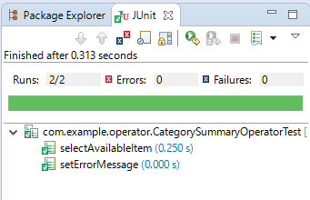
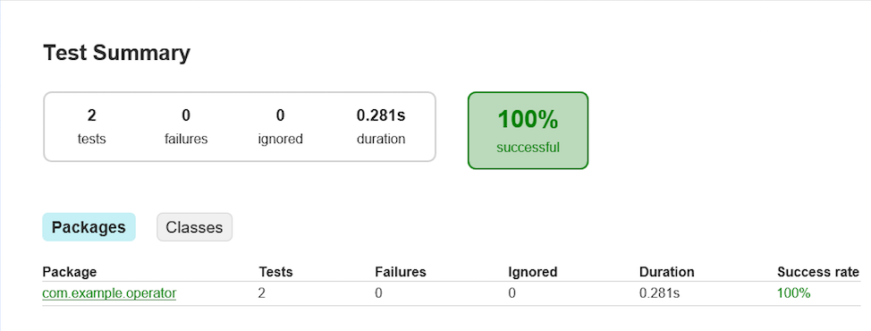

==============
演算子のテスト
==============

このチュートリアルでは演算子のテストを作成する方法を説明していきます。

演算子のテストクラスを作成する
==============================

演算子のテストは演算子メソッドに対する通常の単体テストとして記述します。
このチュートリアルではJUnitを使ったテストクラスとして実装します。

テストクラスはプロジェクトのソースフォルダ ``src/test/java`` 配下に任意のJavaパッケージ名とクラス名を持つクラスとして作成できます。
テスト対象の演算子クラスをベースにしたクラス名を指定すると便利でしょう。

ここでは、 :doc:`dsl-operator-1` で作成した演算子クラス ``CategorySummaryOperator`` に対するテストクラスを以下のように作成します。

..  list-table::
    :widths: 2 5

    * - パッケージ名
      - ``com.example.operator``
    * - クラス名
      - ``CategorySummaryOperatorTest``

..  code-block:: java
    :caption: CategorySummaryOperatorTest.java
    :name: CategorySummaryOperatorTest.java-1

    package com.example.operator;

    public class CategorySummaryOperatorTest {

    }

演算子のテストメソッドを作成する
================================

演算子のテストクラス内に各演算子メソッドに対応するテストメソッドを作成していきます。

演算子メソッドのテストでは通常抽象メソッド ( ``abstract`` ) として宣言した演算子メソッドはテストの対象外とします。
ここでは演算子クラス ``CategorySummaryOperator`` に通常のメソッド(具象メソッド)として定義した、以下の演算子メソッドをテスト対象とします。

* 更新演算子 ``setErrorMessage``
* マスタ選択演算子 ``selectAvailableItem``

更新演算子のテスト
------------------

まず、更新演算子 ``setErrorMessage`` のテストメソッドから作成していきます。

テストクラス ``CategorySummaryOperatorTest`` に対して、JUnitのテストメソッドであることを示す注釈 ``org.junit.Test`` を付与したテストメソッド ``setErrorMessage`` を作成します。

..  code-block:: java
    :caption: CategorySummaryOperatorTest.java
    :name: CategorySummaryOperatorTest.java-2

    import org.junit.Test;
    ...

    @Test
    public void setErrorMessage() {

    }

このテストメソッドに演算子クラスに対するテストを記述していきますが、演算子クラスは抽象クラスとして宣言しているので直接インスタンスを生成できません。
このため、 :ref:`dsl-operator-impl-class` ( 演算子クラス名の末尾に ``Impl`` が付くクラス ) を代わりにインスタンス化します。

例えば演算子クラス ``CategorySummaryOperator`` に対するテストは、演算子実装クラス ``CategorySummaryOperatorImpl`` を使って実装します。

..  code-block:: java
    :caption: CategorySummaryOperatorTest.java
    :name: CategorySummaryOperatorTest.java-3

    @Test
    public void setErrorMessage() {
        CategorySummaryOperator operator = new CategorySummaryOperatorImpl();
        ...
    }

演算子実装クラスのインスタンスに対して、演算子メソッドを利用するテストを記述します。

更新演算子は引数で受け取ったデータモデルオブジェクトを直接変更してこのオブジェクトがそのまま演算子の出力結果となるため、
検証は引数に指定したデータモデルオブジェクトに対して行います。

なお、データモデルオブジェクトは通常のクラスと同じ方法でインスタンス化できます。

..  code-block:: java
    :caption: CategorySummaryOperatorTest.java
    :name: CategorySummaryOperatorTest.java-4

    import static org.hamcrest.Matchers.*;
    import static org.junit.Assert.*;
    ...

    @Test
    public void setErrorMessage() {
        CategorySummaryOperator operator = new CategorySummaryOperatorImpl();

        ErrorRecord record = new ErrorRecord();
        String errorMessage = "エラー内容";
        operator.setErrorMessage(record, errorMessage);

        assertThat(record.getMessageAsString(), is(errorMessage));
    }

マスタ選択演算子のテスト
------------------------

次にマスタ選択演算子 ``selectAvailableItem`` のテストメソッドを作成します。

基本的なテスト作成の流れは `更新演算子のテスト`_ と同様です。

マスタ選択演算子の結果は戻り値として返却されるので、検証は戻り値のデータモデルオブジェクトに対して行います。

..  code-block:: java
    :caption: CategorySummaryOperatorTest.java
    :name: CategorySummaryOperatorTest.java-5

    import static org.hamcrest.Matchers.*;
    import static org.junit.Assert.*;
    ...

    @Test
    public void selectAvailableItem() {
        List<ItemInfo> candidates = new ArrayList<ItemInfo>();
        candidates.add(item("A", 1, 10));
        candidates.add(item("B", 11, 20));
        candidates.add(item("C", 21, 30));

        CategorySummaryOperator operator = new CategorySummaryOperatorImpl();
        ItemInfo item1 = operator.selectAvailableItem(candidates, sales(1));
        ItemInfo item5 = operator.selectAvailableItem(candidates, sales(5));
        ItemInfo item10 = operator.selectAvailableItem(candidates, sales(10));
        ItemInfo item15 = operator.selectAvailableItem(candidates, sales(11));
        ItemInfo item20 = operator.selectAvailableItem(candidates, sales(20));
        ItemInfo item30 = operator.selectAvailableItem(candidates, sales(30));
        ItemInfo item31 = operator.selectAvailableItem(candidates, sales(31));

        assertThat(item1.getCategoryCodeAsString(), is("A"));
        assertThat(item5.getCategoryCodeAsString(), is("A"));
        assertThat(item10.getCategoryCodeAsString(), is("A"));
        assertThat(item15.getCategoryCodeAsString(), is("B"));
        assertThat(item20.getCategoryCodeAsString(), is("B"));
        assertThat(item30.getCategoryCodeAsString(), is("C"));
        assertThat(item31, is(nullValue()));
    }

    private SalesDetail sales(int day) {
        SalesDetail object = new SalesDetail();
        object.setSalesDateTime(new DateTime(2011, 1, day, 0, 0, 0));
        return object;
    }

    private ItemInfo item(String categoryCode, int begin, int end) {
        ItemInfo object = new ItemInfo();
        object.setCategoryCodeAsString(categoryCode);
        object.setBeginDate(new Date(2011, 1, begin));
        object.setEndDate(new Date(2011, 1, end));
        return object;
    }

.. _testing-operator-run-tests:

テストを実行する
================

テストクラスを作成したらテストを実行してみましょう。
テストクラスは通常のJUnitのテストを実行する方法と同じです。

Eclipse上でテストを実行する
---------------------------

Eclipse上からJUnitを実行する方法は様々な方法があります。
一例として、パッケージエクスプローラー上でテストクラスを選択し、コンテキストメニューから ( :menuselection:`Run As --> JUnit Test` ) を選択します。

コマンドライン上でテストを実行する
----------------------------------

コマンドライン上からデータモデルクラス作成する場合は、Gradleの :program:`test` タスクを実行します。

..  code-block:: sh

    ./gradlew test

標準の動作では、テストがすべて成功した場合は ``BUILD SUCCESSFUL`` 、テストが一件でも失敗した場合は ``BUILD FAILED`` が表示されます。

また、プロジェクトのビルドフォルダ ``build/reports/tests`` 配下にテスト結果をまとめたビルドレポート用のHTMLファイルが生成されます。

終わりに
========

このチュートリアル終了時点の演算子テストクラス :file:`CategorySummaryOperatorTest.java` は、次のようになります。

..  literalinclude:: dsl-attachment/CategorySummaryOperatorTest.java
    :language: java
    :linenos:
    :caption: CategorySummaryOperatorTest.java
    :name: CategorySummaryOperatorTest.java-all

関連ドキュメント
================

* :asakusafw:`[Asakusa Framework documentation] - アプリケーションテストスタートガイド <testing/start-guide.html>`

